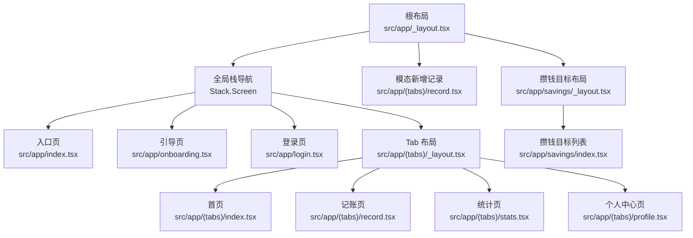
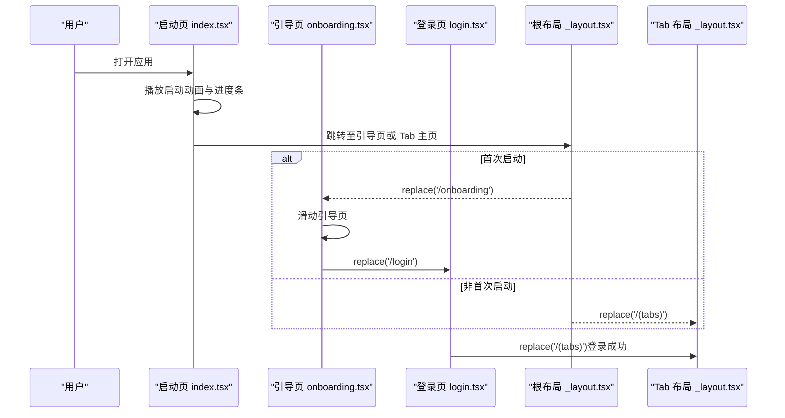
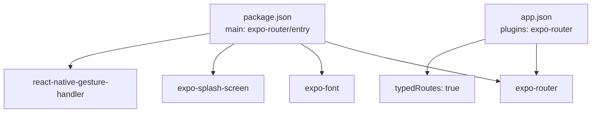

# 路由导航

<cite>
**本文引用的文件**
- [根布局 _layout.tsx](file://src/app/_layout.tsx)
- [Tab 布局 _layout.tsx](file://src/app/(tabs)/_layout.tsx)
- [入口页 index.tsx](file://src/app/index.tsx)
- [登录页 login.tsx](file://src/app/login.tsx)
- [引导页 onboarding.tsx](file://src/app/onboarding.tsx)
- [记账页 record.tsx](file://src/app/(tabs)/record.tsx)
- [个人中心页 profile.tsx](file://src/app/(tabs)/profile.tsx)
- [攒钱目标布局 _layout.tsx](file://src/app/savings/_layout.tsx)
- [攒钱目标列表页 index.tsx](file://src/app/savings/index.tsx)
- [应用配置 app.json](file://app.json)
- [包配置 package.json](file://package.json)
- [颜色常量 colors.ts](file://src/constants/colors.ts)
</cite>

## 目录
1. [简介](#简介)
2. [项目结构](#项目结构)
3. [核心组件](#核心组件)
4. [架构总览](#架构总览)
5. [组件详解](#组件详解)
6. [依赖关系分析](#依赖关系分析)
7. [性能考量](#性能考量)
8. [故障排查指南](#故障排查指南)
9. [结论](#结论)
10. [附录](#附录)

## 简介
本文件系统性梳理“攒钱记账”应用的路由导航体系，基于 Expo Router 的声明式导航实现，覆盖根布局配置、Tab 导航、页面路由规则、启动动画与引导流程、登录验证、导航状态管理、页面生命周期、路由守卫与权限控制、错误处理以及最佳实践与性能优化建议。文档面向不同技术背景的读者，既提供高层架构视图，也给出代码级参考路径。

## 项目结构
应用采用 Expo Router 的约定式路由，页面按目录组织，配合布局文件实现嵌套导航结构：
- 根布局负责全局栈导航与启动屏控制
- Tab 布局封装底部 Tab 导航
- 页面路由包括入口页、引导页、登录页、主 Tab 区域（首页、记账、统计、我的）及子模块（如攒钱目标）

图表来源
- [根布局 _layout.tsx](file://src/app/_layout.tsx#L33-L51)
- [Tab 布局 _layout.tsx](file://src/app/(tabs)/_layout.tsx#L41-L87)
- [入口页 index.tsx](file://src/app/index.tsx#L15-L64)
- [引导页 onboarding.tsx](file://src/app/onboarding.tsx#L109-L125)
- [登录页 login.tsx](file://src/app/login.tsx#L46-L60)
- [记账页 record.tsx](file://src/app/(tabs)/record.tsx#L94-L133)
- [个人中心页 profile.tsx](file://src/app/(tabs)/profile.tsx#L56-L66)
- [攒钱目标布局 _layout.tsx](file://src/app/savings/_layout.tsx#L8-L18)
- [攒钱目标列表页 index.tsx](file://src/app/savings/index.tsx#L121-L137)

章节来源
- [根布局 _layout.tsx](file://src/app/_layout.tsx#L17-L54)
- [Tab 布局 _layout.tsx](file://src/app/(tabs)/_layout.tsx#L39-L88)
- [应用配置 app.json](file://app.json#L1-L29)

## 核心组件
- 根布局与启动屏控制：在根布局中加载字体并在字体加载完成后隐藏启动屏；全局栈导航声明顶层页面与模态页面。
- Tab 布局：集中配置底部 Tab 样式、图标与标签，统一 Tab 样式与交互。
- 页面路由：通过命名路由进行显式跳转，支持 replace、back 等导航动作。
- 模态页面：新增记录页以模态展示，提供沉浸式体验。
- 引导与登录：首次启动进入引导页，完成后进入登录页；登录成功后进入 Tab 主页。

章节来源
- [根布局 _layout.tsx](file://src/app/_layout.tsx#L17-L54)
- [Tab 布局 _layout.tsx](file://src/app/(tabs)/_layout.tsx#L39-L88)
- [入口页 index.tsx](file://src/app/index.tsx#L15-L64)
- [引导页 onboarding.tsx](file://src/app/onboarding.tsx#L109-L125)
- [登录页 login.tsx](file://src/app/login.tsx#L46-L60)
- [记账页 record.tsx](file://src/app/(tabs)/record.tsx#L94-L133)

## 架构总览
下图展示从启动到主界面的关键导航流程，包括启动动画、引导页、登录页与 Tab 主页之间的跳转关系。

图表来源
- [入口页 index.tsx](file://src/app/index.tsx#L52-L61)
- [引导页 onboarding.tsx](file://src/app/onboarding.tsx#L114-L125)
- [登录页 login.tsx](file://src/app/login.tsx#L51-L60)
- [根布局 _layout.tsx](file://src/app/_layout.tsx#L40-L44)

## 组件详解

### 根布局与全局栈导航
- 启动屏控制：防止自动隐藏启动屏，等待字体加载完成后再隐藏。
- 全局栈配置：声明顶层页面与模态页面，统一头部样式与背景色，设置页面切换动画。
- 模态页面：新增记录页以模态呈现，自定义展示方式与动画。

章节来源
- [根布局 _layout.tsx](file://src/app/_layout.tsx#L14-L24)
- [根布局 _layout.tsx](file://src/app/_layout.tsx#L33-L51)

### Tab 导航布局
- 统一 Tab 样式：禁用头部、设置底部栏样式、图标与标签聚焦态。
- 图标组件：根据聚焦状态切换图标与标签颜色，提升视觉反馈。
- Tab 页面：声明四个 Tab 页面，分别对应首页、记账、统计、我的。

章节来源
- [Tab 布局 _layout.tsx](file://src/app/(tabs)/_layout.tsx#L41-L87)
- [Tab 布局 _layout.tsx](file://src/app/(tabs)/_layout.tsx#L13-L37)

### 启动动画与引导流程
- 启动页：Logo 缩放与淡入、进度条动画、微光扫过动画，2.5 秒后根据是否首次启动决定跳转。
- 引导页：三页滑动引导，支持跳过与下一步，最后跳转到登录页。
- 登录页：表单输入与第三方登录，登录成功后替换到 Tab 主页。

章节来源
- [入口页 index.tsx](file://src/app/index.tsx#L21-L64)
- [引导页 onboarding.tsx](file://src/app/onboarding.tsx#L109-L125)
- [登录页 login.tsx](file://src/app/login.tsx#L46-L60)

### 页面路由与导航状态管理
- 页面跳转：使用 replace 或 back 实现页面跳转与返回。
- 导航状态：通过 router 对象管理导航历史与当前页面状态。
- 页面生命周期：页面挂载时执行初始化逻辑，卸载时清理定时器等资源。

章节来源
- [入口页 index.tsx](file://src/app/index.tsx#L52-L64)
- [引导页 onboarding.tsx](file://src/app/onboarding.tsx#L114-L125)
- [登录页 login.tsx](file://src/app/login.tsx#L51-L60)
- [记账页 record.tsx](file://src/app/(tabs)/record.tsx#L128-L133)

### 记账页与模态新增
- 记账页：支持个人/公司账本切换、收支类型切换、分类选择、备注与金额输入。
- 数字键盘：自定义数字键盘，支持输入、删除、清空与确认。
- 模态新增：通过模态展示新增记录页，完成后返回上一页。

章节来源
- [记账页 record.tsx](file://src/app/(tabs)/record.tsx#L94-L133)
- [记账页 record.tsx](file://src/app/(tabs)/record.tsx#L27-L92)

### 个人中心页与登出
- 个人中心：展示用户信息、账本概览与功能菜单。
- 登出：点击退出登录后替换到登录页。

章节来源
- [个人中心页 profile.tsx](file://src/app/(tabs)/profile.tsx#L56-L66)

### 攒钱目标模块
- 布局：独立的栈布局，仅包含目标列表页。
- 列表页：展示目标卡片、筛选账本类型、环形进度条与最近存入信息。

章节来源
- [攒钱目标布局 _layout.tsx](file://src/app/savings/_layout.tsx#L8-L18)
- [攒钱目标列表页 index.tsx](file://src/app/savings/index.tsx#L121-L137)

## 依赖关系分析
- 应用配置：启用 Expo Router 插件与 typedRoutes 实验特性，配置 scheme 与平台信息。
- 包依赖：包含 expo-router、expo-font、expo-splash-screen、expo-status-bar、react-native-gesture-handler 等关键依赖。
- 主入口：package.json 指定 main 为 expo-router/entry，确保路由系统正确初始化。

图表来源
- [包配置 package.json](file://package.json#L1-L43)
- [应用配置 app.json](file://app.json#L21-L26)

章节来源
- [包配置 package.json](file://package.json#L1-L43)
- [应用配置 app.json](file://app.json#L1-L29)

## 性能考量
- 启动屏与字体：在根布局中等待字体加载完成再隐藏启动屏，避免白屏或闪烁。
- 动画与渲染：启动页与引导页使用原生驱动动画，减少 JS 线程压力；Tab 图标聚焦态使用缩放与颜色变化，保持流畅。
- 模态页面：模态页面仅在需要时打开，避免不必要的页面栈增长。
- 导航策略：使用 replace 替换历史记录，减少回退链长度；使用 back 返回上一页，避免重复渲染。

章节来源
- [根布局 _layout.tsx](file://src/app/_layout.tsx#L14-L24)
- [入口页 index.tsx](file://src/app/index.tsx#L21-L51)
- [引导页 onboarding.tsx](file://src/app/onboarding.tsx#L183-L200)

## 故障排查指南
- 启动屏不消失：检查字体加载与启动屏隐藏逻辑，确保字体加载完成后再调用隐藏方法。
- 导航异常：确认路由名称与布局文件一致，避免路径拼写错误；使用 replace 替代 push 以避免历史记录冗余。
- 模态页面无法关闭：确保在操作完成后调用返回或替换到正确页面。
- 颜色主题不一致：检查颜色常量与主题配置，确保全局样式一致。

章节来源
- [根布局 _layout.tsx](file://src/app/_layout.tsx#L14-L24)
- [颜色常量 colors.ts](file://src/constants/colors.ts#L6-L88)

## 结论
本路由导航系统以 Expo Router 为核心，结合根布局与 Tab 布局实现了清晰的层级结构与一致的视觉风格。通过启动动画、引导流程与登录验证串联用户旅程，配合模态页面与页面生命周期管理，提供了良好的用户体验。建议在后续迭代中引入路由守卫与权限控制、错误边界与重试机制，进一步完善系统的健壮性与可维护性。

## 附录
- 路由命名与页面映射
  - 入口页：index
  - 引导页：onboarding
  - 登录页：login
  - Tab 主页：(tabs)
  - 新增记录：record/new（模态）
  - 攒钱目标：savings/index
- 导航示例路径
  - 启动页跳转到引导页：[入口页 index.tsx](file://src/app/index.tsx#L56-L60)
  - 引导页跳转到登录页：[引导页 onboarding.tsx](file://src/app/onboarding.tsx#L119-L120)
  - 登录成功跳转到 Tab 主页：[登录页 login.tsx](file://src/app/login.tsx#L53-L59)
  - 记账页返回上一页：[记账页 record.tsx](file://src/app/(tabs)/record.tsx#L131)
  - 个人中心页登出：[个人中心页 profile.tsx](file://src/app/(tabs)/profile.tsx#L65)