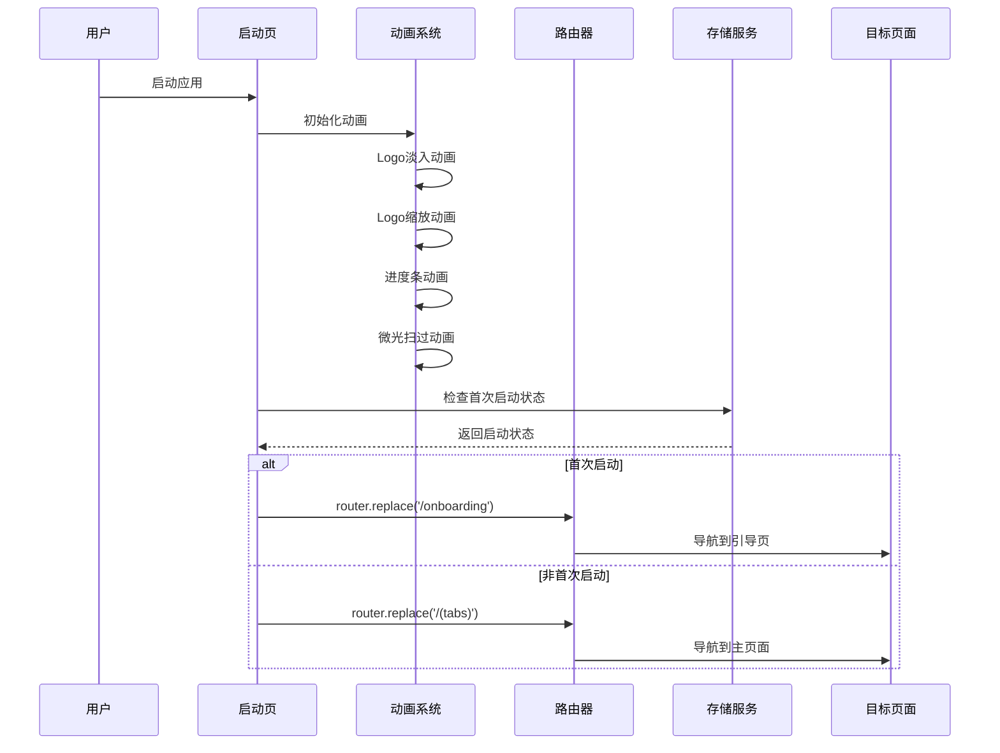
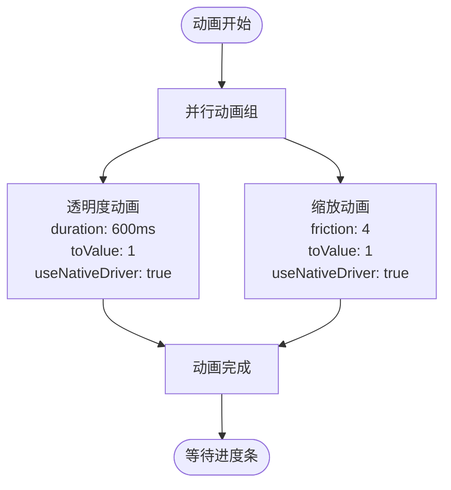
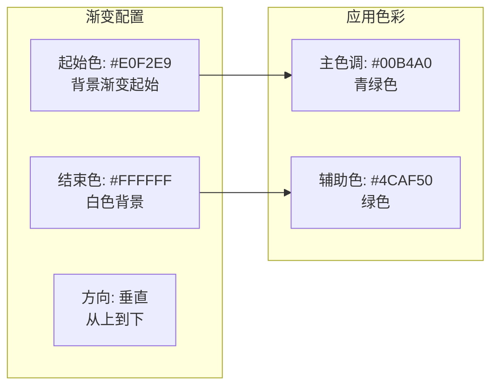
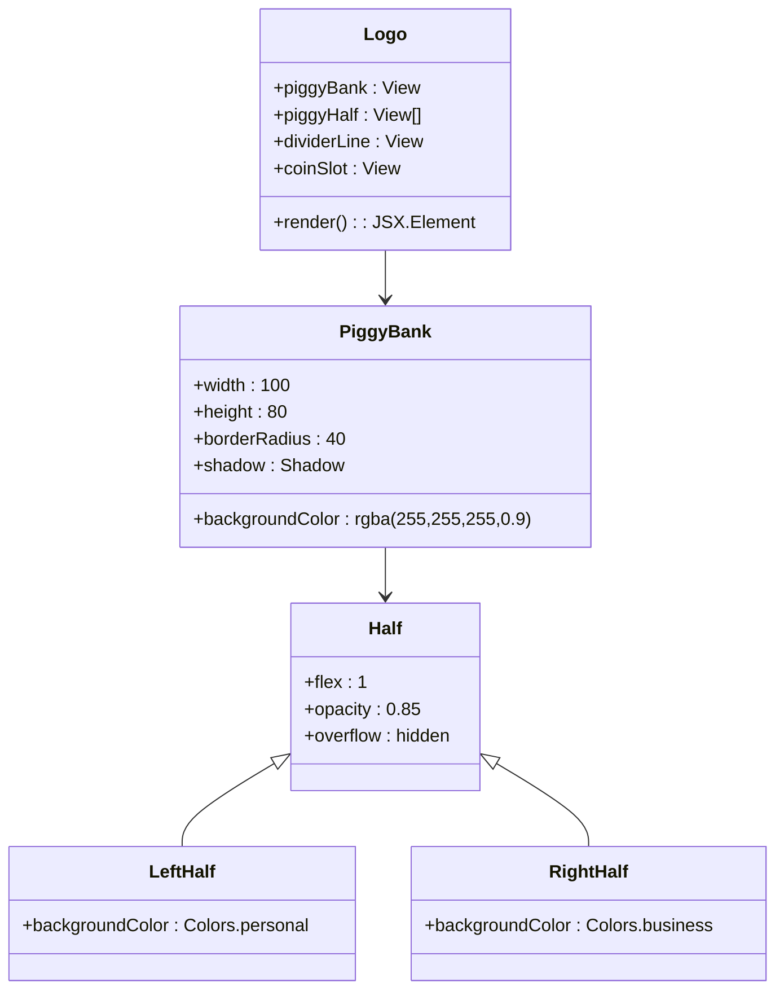
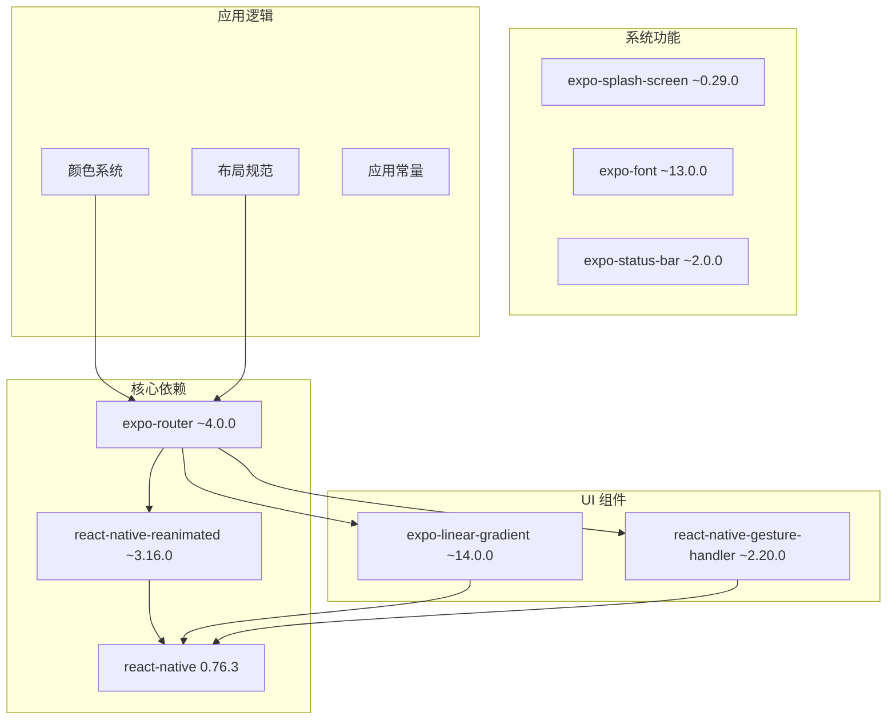

# 启动页路由

<cite>
**本文档引用的文件**
- [src/app/index.tsx](file://src/app/index.tsx)
- [src/app/onboarding.tsx](file://src/app/onboarding.tsx)
- [src/app/_layout.tsx](file://src/app/_layout.tsx)
- [src/app/login.tsx](file://src/app/login.tsx)
- [src/app/(tabs)/_layout.tsx](file://src/app/(tabs)/_layout.tsx)
- [src/constants/colors.ts](file://src/constants/colors.ts)
- [src/constants/layout.ts](file://src/constants/layout.ts)
- [package.json](file://package.json)
- [app.json](file://app.json)
</cite>

## 目录
1. [简介](#简介)
2. [项目结构](#项目结构)
3. [核心组件](#核心组件)
4. [架构概览](#架构概览)
5. [详细组件分析](#详细组件分析)
6. [依赖关系分析](#依赖关系分析)
7. [性能考虑](#性能考虑)
8. [故障排除指南](#故障排除指南)
9. [结论](#结论)

## 简介

启动页路由是移动应用用户体验的关键入口点，负责在应用启动时提供流畅的视觉过渡和正确的导航逻辑。本文档深入解析了基于 Expo Router 构建的启动页实现，包括动画系统的使用、渐变背景配置、Logo 动画效果和进度条动画的完整实现原理。

该启动页采用现代化的设计理念，通过精心设计的动画序列和渐变色彩，为用户提供从应用启动到功能页面的无缝过渡体验。系统实现了智能的导航决策机制，能够根据用户的首次启动状态自动跳转到相应的页面。

## 项目结构

该项目采用基于文件系统的路由架构，所有页面组件都位于 `src/app` 目录下，通过文件名自动映射到对应的路由路径。这种架构提供了清晰的组织结构和直观的路由管理。

```mermaid
graph TB
subgraph "应用根目录"
Root[根布局 _layout.tsx]
subgraph "页面组件"
Index[启动页 index.tsx]
Onboarding[引导页 onboarding.tsx]
Login[登录页 login.tsx]
Tabs[标签页布局 (tabs)/_layout.tsx]
end
subgraph "常量定义"
Colors[颜色系统 colors.ts]
Layout[布局规范 layout.ts]
end
end
Root --> Index
Root --> Onboarding
Root --> Login
Root --> Tabs
Index --> Colors
Index --> Layout
Onboarding --> Colors
Login --> Colors
Tabs --> Colors
```

**图表来源**
- [src/app/_layout.tsx](file://src/app/_layout.tsx#L30-L47)
- [src/app/index.tsx](file://src/app/index.tsx#L1-L249)

**章节来源**
- [src/app/_layout.tsx](file://src/app/_layout.tsx#L1-L55)
- [src/app/index.tsx](file://src/app/index.tsx#L1-L249)

## 核心组件

启动页路由系统由多个核心组件协同工作，每个组件都有明确的职责和功能定位：

### 启动页组件 (SplashPage)
启动页是应用的入口界面，负责执行完整的动画序列并在适当的时间进行页面跳转。该组件使用 React Hooks 和 Animated API 实现复杂的动画效果。

### 引导页组件 (OnboardingPage)
引导页专门处理首次启动用户的介绍流程，提供多步骤的引导内容展示和交互控制。

### 根布局组件 (RootLayout)
根布局负责全局的路由配置、状态栏管理和字体加载控制，确保应用启动过程的平滑过渡。

### 登录页组件 (LoginPage)
登录页提供用户身份验证功能，支持多种登录方式和表单验证。

**章节来源**
- [src/app/index.tsx](file://src/app/index.tsx#L15-L147)
- [src/app/onboarding.tsx](file://src/app/onboarding.tsx#L69-L129)
- [src/app/_layout.tsx](file://src/app/_layout.tsx#L17-L47)

## 架构概览

启动页路由系统采用分层架构设计，通过明确的职责分离和模块化组织实现了高内聚低耦合的系统结构。



**图表来源**
- [src/app/index.tsx](file://src/app/index.tsx#L21-L64)
- [src/app/_layout.tsx](file://src/app/_layout.tsx#L33-L45)

系统的核心优势在于其智能化的导航逻辑，能够根据用户状态自动选择最合适的后续页面，避免了不必要的用户交互。

## 详细组件分析

### 启动页动画系统

启动页实现了多层次的动画效果，通过 Animated API 的组合使用创造了丰富的视觉体验。

#### Logo 动画序列
Logo 动画包含两个主要部分：透明度渐变和缩放变换。这两个动画通过 `Animated.parallel` 并行执行，创造出协调一致的视觉效果。



**图表来源**
- [src/app/index.tsx](file://src/app/index.tsx#L23-L34)

#### 进度条动画
进度条动画使用 `Animated.timing` 实现，具有 2 秒的总持续时间。该动画通过插值函数将数值范围映射到宽度范围，实现从 0% 到 100% 的平滑填充效果。

#### 微光扫过动画
微光效果通过循环定时动画实现，使用 `Animated.loop` 创建无限循环效果。动画在屏幕宽度范围内移动，创造出动态的光影效果。

**章节来源**
- [src/app/index.tsx](file://src/app/index.tsx#L21-L50)

### 渐变背景配置

启动页采用了精心设计的渐变背景系统，通过 Linear Gradient 组件实现从浅绿色到白色的柔和过渡。

#### 渐变色彩系统
渐变背景使用了预定义的颜色配置，确保了视觉的一致性和品牌识别度。



**图表来源**
- [src/app/index.tsx](file://src/app/index.tsx#L77-L82)
- [src/constants/colors.ts](file://src/constants/colors.ts#L78-L85)

**章节来源**
- [src/app/index.tsx](file://src/app/index.tsx#L77-L82)
- [src/constants/colors.ts](file://src/constants/colors.ts#L78-L85)

### Logo 动画效果

启动页的 Logo 设计采用了独特的存钱罐图标，通过两个半圆形的组合创造出立体的视觉效果。

#### Logo 结构设计
Logo 由多个几何元素组成，包括主体框架、分隔线和投币口等细节元素。



**图表来源**
- [src/app/index.tsx](file://src/app/index.tsx#L95-L105)
- [src/constants/colors.ts](file://src/constants/colors.ts#L14-L21)

**章节来源**
- [src/app/index.tsx](file://src/app/index.tsx#L95-L105)
- [src/constants/colors.ts](file://src/constants/colors.ts#L14-L21)

### 导航逻辑实现

启动页的导航逻辑基于用户状态判断，实现了智能的页面跳转机制。

#### 首次启动检测
系统通过模拟变量 `isFirstLaunch` 来判断用户是否为首次启动。在实际应用中，应该替换为真实的存储检查逻辑。

#### 路由跳转策略
根据首次启动状态，系统使用 `router.replace()` 方法进行页面跳转，确保用户不会回到启动页。

```mermaid
flowchart TD
Start([启动页加载]) --> Timer[设置2.5秒延迟]
Timer --> Check[检查首次启动状态]
Check --> FirstLaunch{首次启动?}
FirstLaunch --> |是| Onboarding[导航到引导页<br/>router.replace('/onboarding')]
FirstLaunch --> |否| Tabs[导航到主页面<br/>router.replace('/(tabs)')]
Onboarding --> End([跳转完成])
Tabs --> End
```

**图表来源**
- [src/app/index.tsx](file://src/app/index.tsx#L53-L61)

**章节来源**
- [src/app/index.tsx](file://src/app/index.tsx#L53-L61)

### 动画参数配置

启动页使用了多种动画类型和参数配置，每种配置都有特定的性能和视觉效果考量。

#### Spring 动画配置
Spring 动画使用摩擦力参数控制回弹效果，摩擦力值为 4 提供了适中的回弹强度。

#### Timing 动画配置
Timing 动画配置了不同的持续时间：
- Logo 动画：600ms
- 进度条动画：2000ms
- 微光动画：1500ms

#### Native Driver 使用策略
- 使用原生驱动的动画：Logo 缩放、微光扫过
- 不使用原生驱动的动画：进度条动画

**章节来源**
- [src/app/index.tsx](file://src/app/index.tsx#L24-L50)

### 路由跳转时机

启动页的路由跳转时机经过精心设计，确保了最佳的用户体验。

#### 时间控制机制
系统使用 2.5 秒的延迟时间，给用户足够的时间观察动画效果，同时避免等待时间过长。

#### 清理机制
使用 `useEffect` 返回的清理函数确保定时器被正确清除，防止内存泄漏。

**章节来源**
- [src/app/index.tsx](file://src/app/index.tsx#L52-L64)

## 依赖关系分析

启动页路由系统涉及多个关键依赖项，每个依赖都有其特定的作用和影响。



**图表来源**
- [package.json](file://package.json#L11-L34)
- [src/app/_layout.tsx](file://src/app/_layout.tsx#L5-L12)

### 关键依赖项分析

#### Expo Router
作为主要的路由解决方案，Expo Router 提供了声明式的路由配置和强大的导航能力。

#### React Native Reanimated
提供了高性能的动画支持，特别是原生驱动的动画效果。

#### Expo Linear Gradient
实现了高质量的渐变背景效果，增强了视觉体验。

**章节来源**
- [package.json](file://package.json#L11-L34)

## 性能考虑

启动页路由系统在设计时充分考虑了性能优化，采用了多种策略确保流畅的用户体验。

### 动画性能优化

#### 原生驱动优先
- Logo 缩放和微光扫过使用原生驱动，提升动画性能
- 进度条动画不使用原生驱动，确保精确的数值控制

#### 动画时长平衡
- Logo 动画：600ms - 适中的视觉效果
- 进度条动画：2000ms - 提供足够的视觉反馈
- 微光动画：1500ms - 保持动态效果但不过于频繁

### 内存管理

#### 定时器清理
使用 `useEffect` 返回的清理函数确保定时器被正确清除，防止内存泄漏。

#### 动画资源管理
合理使用 `useRef` 创建动画值，避免不必要的重新渲染。

### 启动性能优化

#### 字体加载优化
根布局使用 `expo-font` 和 `expo-splash-screen` 确保字体加载完成后再隐藏启动屏。

#### 渐变渲染优化
使用预定义的渐变配置，减少运行时计算开销。

**章节来源**
- [src/app/index.tsx](file://src/app/index.tsx#L52-L64)
- [src/app/_layout.tsx](file://src/app/_layout.tsx#L14-L24)

## 故障排除指南

### 常见问题及解决方案

#### 动画不显示问题
- 检查 `useNativeDriver` 设置是否正确
- 确认动画值的初始状态设置
- 验证 `Animated.View` 的样式配置

#### 导航跳转失败
- 确认路由名称与文件名匹配
- 检查 `router.replace` 的参数格式
- 验证路由配置是否正确

#### 渐变背景异常
- 检查颜色值的有效性
- 确认渐变方向配置
- 验证容器样式设置

#### 性能问题
- 监控动画帧率
- 检查是否有过多的重渲染
- 优化复杂动画的组合

### 调试技巧

#### 动画调试
使用 `console.log` 输出动画值的变化
监控 `useNativeDriver` 的性能影响
测试不同设备上的动画表现

#### 路由调试
启用 Expo Router 的调试模式
检查路由历史记录
验证导航参数传递

#### 性能监控
使用 React DevTools Profiler
监控内存使用情况
分析启动时间指标

**章节来源**
- [src/app/index.tsx](file://src/app/index.tsx#L21-L64)
- [src/app/_layout.tsx](file://src/app/_layout.tsx#L17-L28)

## 结论

启动页路由系统展现了现代移动应用开发的最佳实践，通过精心设计的动画效果、智能的导航逻辑和完善的性能优化，为用户提供了优质的启动体验。

### 系统优势

1. **流畅的动画体验**：多层次的动画组合创造了丰富的视觉效果
2. **智能的导航逻辑**：根据用户状态自动选择合适的后续页面
3. **优秀的性能表现**：合理的动画配置和内存管理确保了流畅运行
4. **清晰的架构设计**：模块化的组件结构便于维护和扩展

### 改进建议

1. **真实存储集成**：将首次启动检测替换为真实的 AsyncStorage 实现
2. **动画参数可配置化**：允许通过配置文件调整动画时长和效果
3. **多语言支持**：添加国际化支持以适应不同地区用户
4. **无障碍访问**：增强屏幕阅读器支持和键盘导航

该启动页路由系统为整个应用奠定了良好的基础，通过持续的优化和改进，可以为用户提供更加出色的移动应用体验。