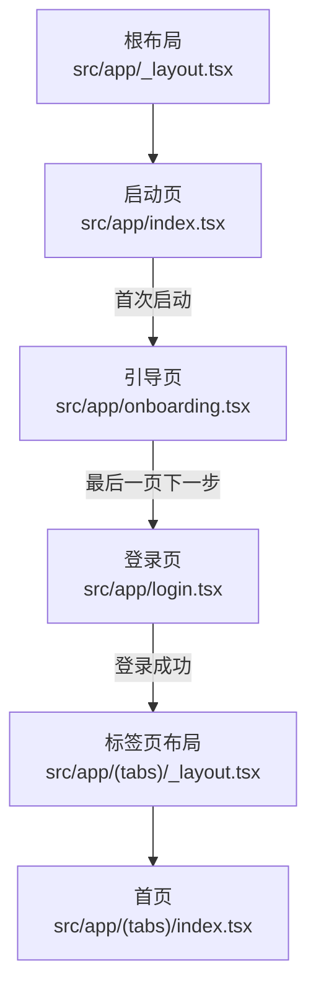
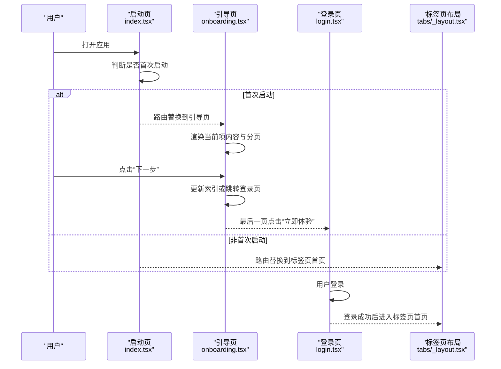
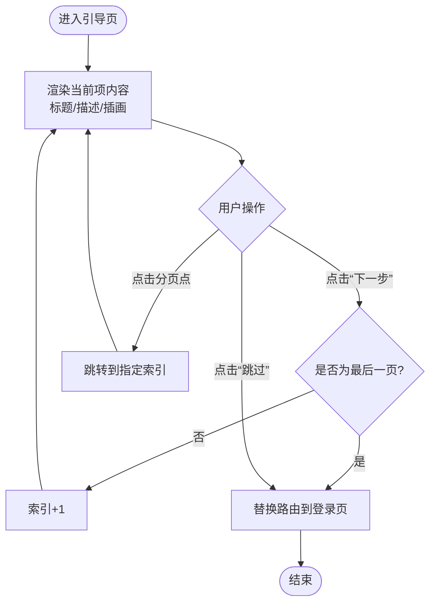
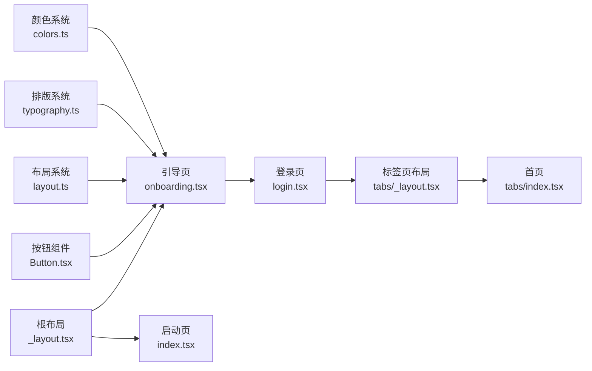

# 引导页路由

<cite>
**本文引用的文件**
- [src/app/onboarding.tsx](file://src/app/onboarding.tsx)
- [src/app/_layout.tsx](file://src/app/_layout.tsx)
- [src/app/index.tsx](file://src/app/index.tsx)
- [src/app/login.tsx](file://src/app/login.tsx)
- [src/app/(tabs)/_layout.tsx](file://src/app/(tabs)/_layout.tsx)
- [src/app/(tabs)/index.tsx](file://src/app/(tabs)/index.tsx)
- [src/components/ui/Button.tsx](file://src/components/ui/Button.tsx)
- [src/constants/colors.ts](file://src/constants/colors.ts)
- [src/constants/typography.ts](file://src/constants/typography.ts)
- [src/constants/layout.ts](file://src/constants/layout.ts)
- [app.json](file://app.json)
</cite>

## 目录
1. [引言](#引言)
2. [项目结构](#项目结构)
3. [核心组件](#核心组件)
4. [架构总览](#架构总览)
5. [详细组件分析](#详细组件分析)
6. [依赖关系分析](#依赖关系分析)
7. [性能考量](#性能考量)
8. [故障排查指南](#故障排查指南)
9. [结论](#结论)
10. [附录](#附录)

## 引言
本文件聚焦于“引导页路由”（Onboarding）的设计与实现，系统性阐述其在应用启动流程中的作用、页面结构与交互、与启动页的衔接逻辑、完成引导后的跳转目标，以及内容定制（多语言与个性化）、状态管理与用户偏好保存机制。该引导页采用轻量的三步介绍模式，通过插画、标题与描述配合分页指示器与按钮，帮助新用户快速理解产品核心能力。

## 项目结构
引导页路由位于应用的客户端路由体系中，与启动页、登录页、主功能页共同构成完整的首屏体验链路。根布局负责声明所有屏幕并统一栈配置；引导页作为独立页面参与路由切换；登录页与主标签页（Tabs）在后续流程中承接用户进入应用后的操作路径。

图表来源
- [src/app/_layout.tsx](file://src/app/_layout.tsx#L33-L45)
- [src/app/index.tsx](file://src/app/index.tsx#L52-L61)
- [src/app/onboarding.tsx](file://src/app/onboarding.tsx#L72-L82)
- [src/app/login.tsx](file://src/app/login.tsx#L51-L60)
- [src/app/(tabs)/_layout.tsx](file://src/app/(tabs)/_layout.tsx#L41-L87)

章节来源
- [src/app/_layout.tsx](file://src/app/_layout.tsx#L33-L45)
- [src/app/index.tsx](file://src/app/index.tsx#L52-L61)
- [src/app/onboarding.tsx](file://src/app/onboarding.tsx#L69-L129)
- [src/app/login.tsx](file://src/app/login.tsx#L46-L60)
- [src/app/(tabs)/_layout.tsx](file://src/app/(tabs)/_layout.tsx#L39-L87)

## 核心组件
- 引导页页面组件：负责渲染当前项内容、分页指示器、跳过与下一步按钮，并在最后一页将用户引导至登录页。
- 插画组件：基于当前项的颜色与表情符号生成视觉插画，辅以装饰圆点提升层次感。
- 按钮组件：统一的渐变按钮样式，支持全宽、禁用、加载态等特性，用于“下一步/立即体验”。
- 根布局与路由声明：集中声明 index、onboarding、login、tabs 等屏幕，统一栈配置与动画。
- 启动页：负责首屏展示与首次启动判断，决定跳转至引导页或直接进入主功能页。
- 登录页与标签页：完成引导后的标准用户路径，登录成功后进入标签页首页。

章节来源
- [src/app/onboarding.tsx](file://src/app/onboarding.tsx#L21-L51)
- [src/app/onboarding.tsx](file://src/app/onboarding.tsx#L54-L67)
- [src/components/ui/Button.tsx](file://src/components/ui/Button.tsx#L36-L189)
- [src/app/_layout.tsx](file://src/app/_layout.tsx#L33-L45)
- [src/app/index.tsx](file://src/app/index.tsx#L52-L61)
- [src/app/login.tsx](file://src/app/login.tsx#L46-L60)
- [src/app/(tabs)/index.tsx](file://src/app/(tabs)/index.tsx#L47-L58)

## 架构总览
引导页路由在整体架构中的位置如下：

图表来源
- [src/app/index.tsx](file://src/app/index.tsx#L52-L61)
- [src/app/onboarding.tsx](file://src/app/onboarding.tsx#L72-L82)
- [src/app/login.tsx](file://src/app/login.tsx#L51-L60)
- [src/app/(tabs)/_layout.tsx](file://src/app/(tabs)/_layout.tsx#L41-L87)

## 详细组件分析

### 引导页页面（OnboardingPage）
- 页面结构
  - 顶部右上角“跳过”按钮，点击后直接进入登录页。
  - 中央内容区包含插画容器、标题与描述文本。
  - 底部分页指示器，支持点击任意页码跳转。
  - 底部按钮，最后一页显示“立即体验”，其余显示“下一步”。

- 交互流程
  - “下一步”：若非最后一页则递增索引，否则替换路由到登录页。
  - “跳过”：直接替换路由到登录页。
  - 分页指示器：点击对应索引更新当前展示项。

- 视觉与主题
  - 使用颜色系统中的背景、文字与强调色，结合渐变阴影与圆角规范。
  - 插画使用当前项颜色生成半透明圆形背景与装饰点，增强层次与品牌一致性。

- 数据模型
  - 项类型包含 id、标题、描述、表情符号与颜色，数据源为本地数组。

图表来源
- [src/app/onboarding.tsx](file://src/app/onboarding.tsx#L69-L129)

章节来源
- [src/app/onboarding.tsx](file://src/app/onboarding.tsx#L69-L129)
- [src/app/onboarding.tsx](file://src/app/onboarding.tsx#L21-L51)
- [src/constants/colors.ts](file://src/constants/colors.ts#L6-L75)
- [src/constants/layout.ts](file://src/constants/layout.ts#L22-L34)
- [src/constants/typography.ts](file://src/constants/typography.ts#L33-L44)

### 插画组件（Illustration）
- 组件职责：根据当前项颜色与表情符号绘制插画背景与装饰点，保持与主题一致的视觉风格。
- 设计要点：半透明圆形背景、品牌色点缀、层级与阴影统一。

章节来源
- [src/app/onboarding.tsx](file://src/app/onboarding.tsx#L54-L67)
- [src/constants/colors.ts](file://src/constants/colors.ts#L14-L27)
- [src/constants/layout.ts](file://src/constants/layout.ts#L37-L95)

### 按钮组件（Button）
- 组件职责：提供统一的渐变按钮样式，支持多种变体与尺寸，适配引导页的“下一步/立即体验”场景。
- 设计要点：渐变背景、圆角、阴影、文字样式与图标位置控制。

章节来源
- [src/components/ui/Button.tsx](file://src/components/ui/Button.tsx#L36-L189)
- [src/constants/colors.ts](file://src/constants/colors.ts#L7-L12)
- [src/constants/typography.ts](file://src/constants/typography.ts#L119-L125)
- [src/constants/layout.ts](file://src/constants/layout.ts#L9-L19)

### 根布局与路由声明（RootLayout）
- 负责声明所有屏幕（index、onboarding、login、tabs、savings），统一栈配置与动画。
- 关闭默认头部，设置内容背景色与滑动动画。

章节来源
- [src/app/_layout.tsx](file://src/app/_layout.tsx#L33-L45)

### 启动页（SplashPage）
- 负责首屏展示与动画，2.5 秒后根据“是否首次启动”的判断决定跳转：
  - 首次启动：跳转到引导页；
  - 非首次启动：跳转到标签页首页。
- 实际应用中，“首次启动”应通过持久化存储进行判断，当前示例使用模拟值。

章节来源
- [src/app/index.tsx](file://src/app/index.tsx#L52-L61)

### 登录页（LoginPage）
- 完成引导后的标准登录入口，登录成功后替换路由到标签页首页。
- 提供表单输入、第三方登录入口与协议提示。

章节来源
- [src/app/login.tsx](file://src/app/login.tsx#L46-L60)

### 标签页布局与首页（Tabs Layout & Home）
- 标签页布局定义底部导航与图标样式。
- 首页展示资产概览、快速记账、攒钱目标与最近记录，作为登录后的主界面。

章节来源
- [src/app/(tabs)/_layout.tsx](file://src/app/(tabs)/_layout.tsx#L39-L87)
- [src/app/(tabs)/index.tsx](file://src/app/(tabs)/index.tsx#L47-L58)

## 依赖关系分析
- 组件耦合
  - 引导页依赖按钮组件与常量系统（颜色、排版、布局）。
  - 启动页与引导页之间通过路由连接，形成首屏体验链路。
  - 登录页与标签页布局共同构成用户进入应用后的主流程。
- 外部依赖
  - 路由：expo-router 的 router 与 Stack 声明。
  - UI：LinearGradient、StatusBar、SafeAreaView 等。
  - 动画：Animated 与 Expo 动画库。

图表来源
- [src/app/onboarding.tsx](file://src/app/onboarding.tsx#L1-L20)
- [src/constants/colors.ts](file://src/constants/colors.ts#L6-L75)
- [src/constants/typography.ts](file://src/constants/typography.ts#L33-L44)
- [src/constants/layout.ts](file://src/constants/layout.ts#L22-L34)
- [src/components/ui/Button.tsx](file://src/components/ui/Button.tsx#L36-L189)
- [src/app/_layout.tsx](file://src/app/_layout.tsx#L33-L45)
- [src/app/index.tsx](file://src/app/index.tsx#L52-L61)
- [src/app/login.tsx](file://src/app/login.tsx#L51-L60)
- [src/app/(tabs)/_layout.tsx](file://src/app/(tabs)/_layout.tsx#L41-L87)
- [src/app/(tabs)/index.tsx](file://src/app/(tabs)/index.tsx#L47-L58)

## 性能考量
- 动画与渲染
  - 引导页与启动页均使用原生驱动与非原生驱动的混合策略，确保流畅度与兼容性。
  - 插画与装饰点采用纯样式与少量容器，避免过度嵌套。
- 路由与栈
  - 根布局统一关闭头部并启用滑动动画，减少不必要的重绘。
- 组件复用
  - 按钮与卡片等 UI 组件通过常量系统统一风格，降低重复计算与样式冲突。

## 故障排查指南
- 首次启动判断不生效
  - 现状：启动页使用模拟值判断是否首次启动。
  - 建议：接入持久化存储（如 AsyncStorage）保存“是否首次启动”标记，并在启动页读取与更新。
- 引导页无法跳转登录页
  - 现状：最后一页点击“下一步”会替换路由到登录页。
  - 排查：确认路由名称与根布局声明一致，检查 router.replace 调用时机。
- 分页指示器点击无效
  - 现状：支持点击任意页码跳转。
  - 排查：确认索引更新逻辑与渲染条件，避免索引越界。
- 登录成功后未进入标签页首页
  - 现状：登录页登录成功后替换路由到标签页首页。
  - 排查：确认路由目标与标签页布局的 screen 名称一致。

章节来源
- [src/app/index.tsx](file://src/app/index.tsx#L52-L61)
- [src/app/onboarding.tsx](file://src/app/onboarding.tsx#L72-L82)
- [src/app/login.tsx](file://src/app/login.tsx#L51-L60)
- [src/app/(tabs)/_layout.tsx](file://src/app/(tabs)/_layout.tsx#L41-L87)

## 结论
引导页路由在应用首屏体验中承担关键角色：以简洁的三步介绍与直观的交互，帮助新用户快速理解产品价值并顺利进入登录流程。通过统一的常量系统与可复用 UI 组件，引导页实现了良好的视觉一致性与开发效率。建议在后续版本中完善“首次启动”判断与用户偏好保存机制，进一步优化用户体验。

## 附录

### 引导页与启动页的衔接逻辑
- 启动页在 2.5 秒后根据“是否首次启动”决定跳转：
  - 首次启动：跳转到引导页；
  - 非首次启动：跳转到标签页首页。
- 实际应用中应使用持久化存储替代模拟判断。

章节来源
- [src/app/index.tsx](file://src/app/index.tsx#L52-L61)

### 用户完成引导后的跳转目标
- 引导页最后一页点击“下一步”后，替换路由到登录页。
- 登录页登录成功后，替换路由到标签页首页。

章节来源
- [src/app/onboarding.tsx](file://src/app/onboarding.tsx#L72-L82)
- [src/app/login.tsx](file://src/app/login.tsx#L51-L60)

### 引导页内容定制方案
- 多语言支持
  - 将引导页数据源从硬编码改为外部配置或国际化资源映射，按语言环境动态选择标题、描述与表情符号。
  - 在应用启动阶段加载对应语言包，渲染时根据当前语言切换文案。
- 个性化配置
  - 支持按用户画像或设备特性调整展示顺序、颜色或文案风格。
  - 可扩展为 A/B 实验，针对不同用户群体展示差异化内容。
- 主题与样式
  - 通过颜色系统与排版系统统一风格，确保不同语言与个性化组合下的一致性。

章节来源
- [src/app/onboarding.tsx](file://src/app/onboarding.tsx#L21-L51)
- [src/constants/colors.ts](file://src/constants/colors.ts#L6-L75)
- [src/constants/typography.ts](file://src/constants/typography.ts#L33-L44)

### 状态管理与用户偏好保存机制
- 当前实现
  - 引导页使用本地状态管理当前索引，页面切换时销毁。
  - 首次启动判断在启动页使用模拟值，未持久化。
- 建议方案
  - 首次启动标记：使用持久化存储保存“是否首次启动”，并在启动页读取与更新。
  - 用户偏好：在登录后将引导完成状态写入持久化存储，避免重复展示。
  - 引导页状态：可在本地状态基础上增加“是否已引导完成”的标志位，便于后续流程控制。

章节来源
- [src/app/onboarding.tsx](file://src/app/onboarding.tsx#L70-L78)
- [src/app/index.tsx](file://src/app/index.tsx#L52-L61)