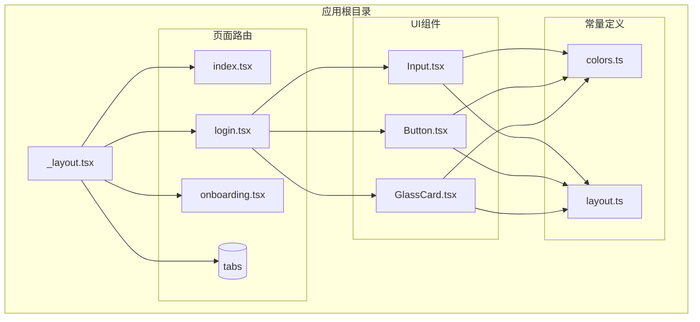
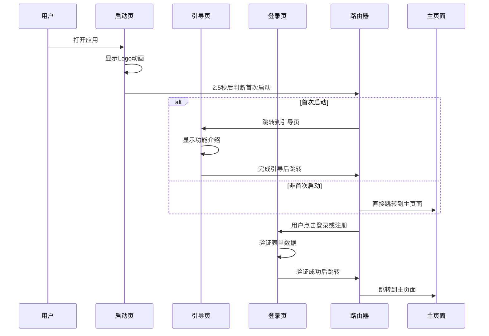
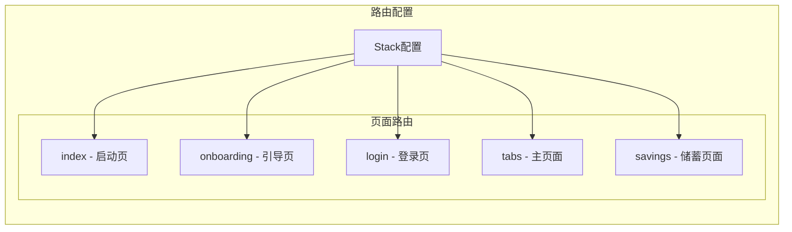
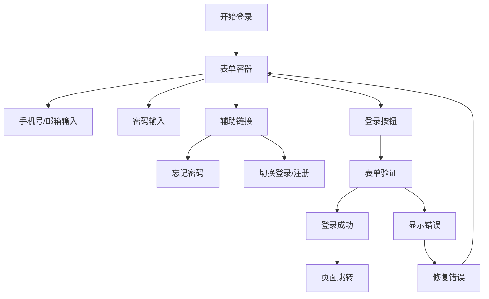
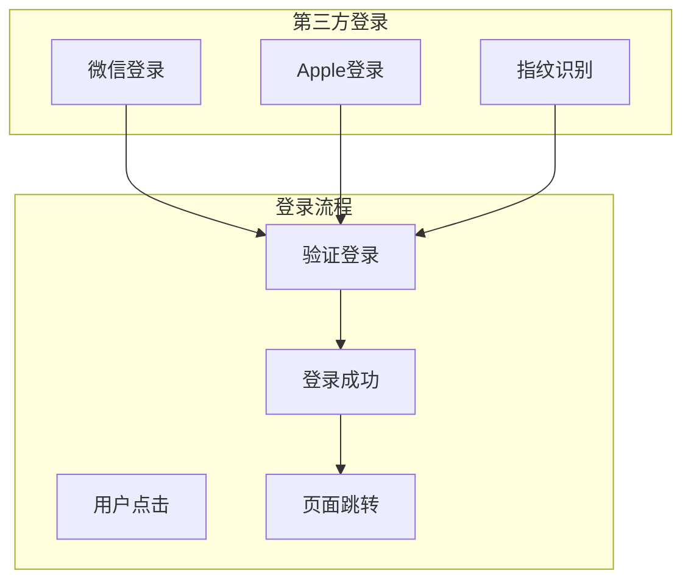
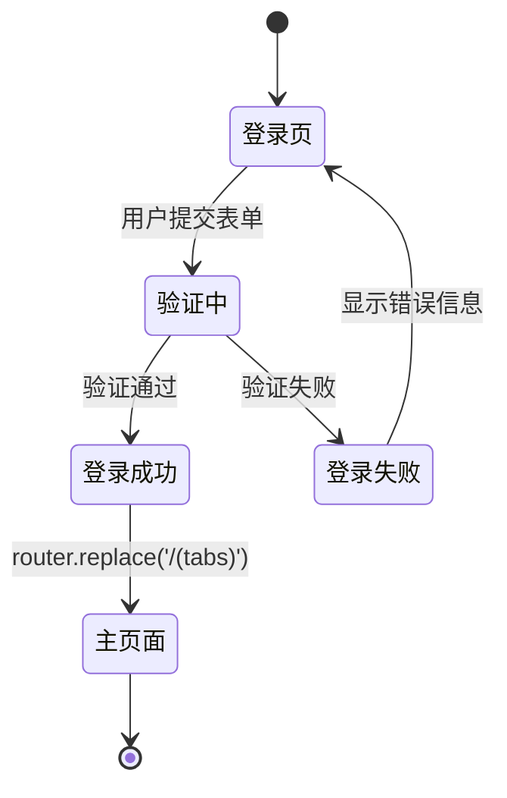
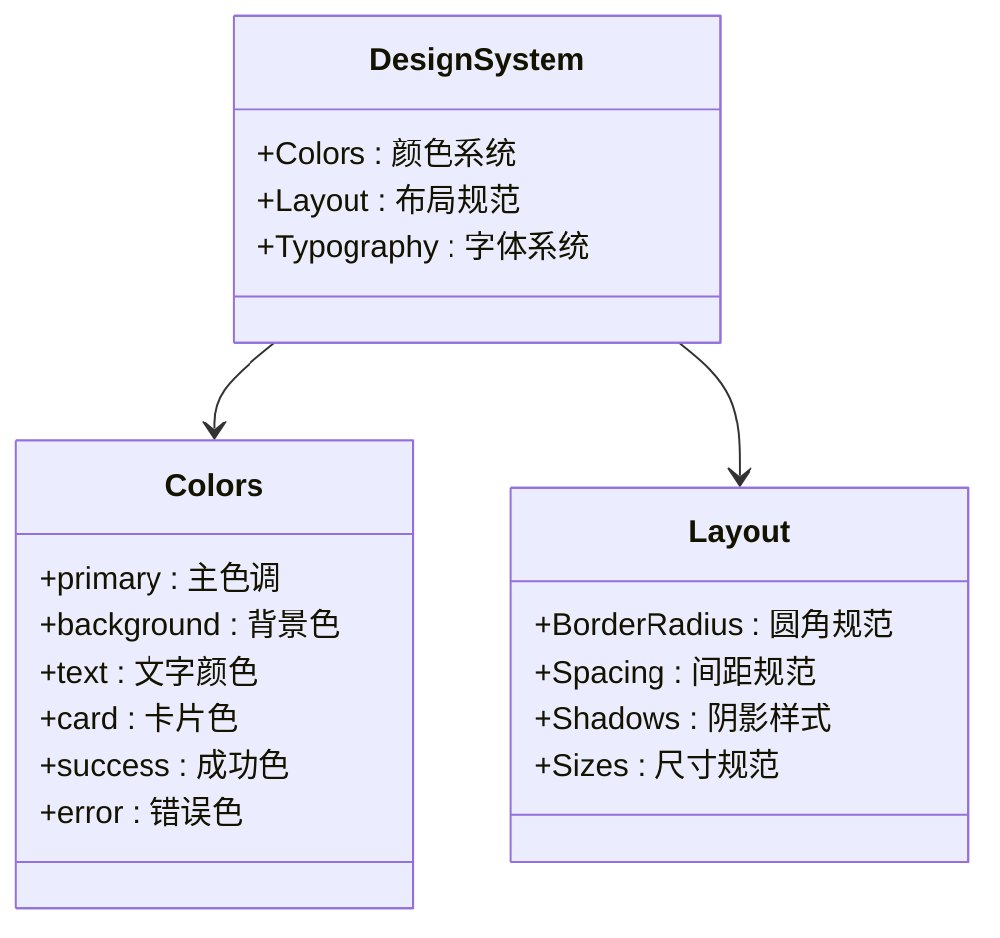
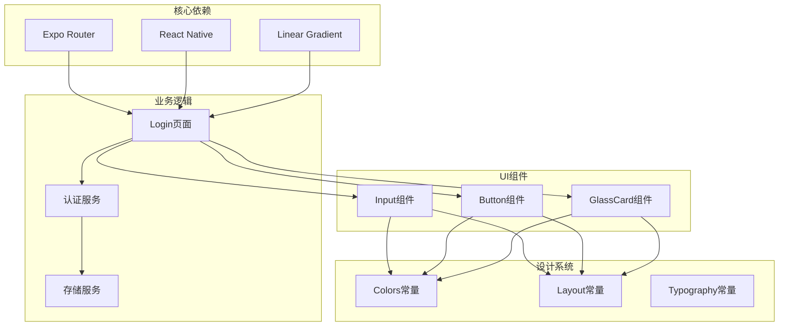

# 登录页路由

<cite>
**本文档引用的文件**
- [src/app/login.tsx](file://src/app/login.tsx)
- [src/app/_layout.tsx](file://src/app/_layout.tsx)
- [src/app/index.tsx](file://src/app/index.tsx)
- [src/app/onboarding.tsx](file://src/app/onboarding.tsx)
- [src/components/ui/Input.tsx](file://src/components/ui/Input.tsx)
- [src/components/ui/Button.tsx](file://src/components/ui/Button.tsx)
- [src/components/ui/GlassCard.tsx](file://src/components/ui/GlassCard.tsx)
- [src/constants/colors.ts](file://src/constants/colors.ts)
- [src/constants/layout.ts](file://src/constants/layout.ts)
- [src/types/index.ts](file://src/types/index.ts)
- [package.json](file://package.json)
</cite>

## 目录
1. [简介](#简介)
2. [项目结构](#项目结构)
3. [核心组件](#核心组件)
4. [架构概览](#架构概览)
5. [详细组件分析](#详细组件分析)
6. [依赖关系分析](#依赖关系分析)
7. [性能考虑](#性能考虑)
8. [故障排除指南](#故障排除指南)
9. [结论](#结论)

## 简介

本文档详细分析了"攒钱记账"应用中的登录页路由系统。该应用采用React Native + Expo Router构建，实现了完整的用户认证流程，包括登录表单、第三方登录、表单验证和页面跳转逻辑。

登录页是用户进入应用的核心入口，负责处理用户身份验证、状态管理和页面导航。本文将深入解析登录页的认证流程、安全机制、表单实现和状态管理方案。

## 项目结构

该项目采用基于文件系统的路由架构，所有页面都位于`src/app/`目录下。登录页作为应用的主要入口之一，与其他页面协同工作形成完整的用户体验流程。

**图表来源**
- [src/app/_layout.tsx](file://src/app/_layout.tsx#L30-L47)
- [src/app/login.tsx](file://src/app/login.tsx#L1-L20)

**章节来源**
- [src/app/_layout.tsx](file://src/app/_layout.tsx#L1-L55)
- [src/app/login.tsx](file://src/app/login.tsx#L1-L50)

## 核心组件

登录页由多个精心设计的组件构成，每个组件都有明确的职责和设计规范：

### 主要组件职责

1. **LoginPage组件** - 登录页的核心容器，管理表单状态和用户交互
2. **Input组件** - 自定义输入框，支持多种输入类型和验证状态
3. **Button组件** - 渐变按钮，提供多种样式变体和交互反馈
4. **GlassCard组件** - 毛玻璃效果卡片，营造现代视觉体验
5. **Icon组件** - 简化的图标系统，使用Unicode字符实现

### 设计系统集成

应用采用了统一的设计语言，包括：
- **色彩系统**：基于青绿色渐变的主题色，象征成长与清晰
- **布局规范**：标准化的圆角、阴影和间距系统
- **字体系统**：清晰易读的字体层次结构

**章节来源**
- [src/app/login.tsx](file://src/app/login.tsx#L46-L177)
- [src/components/ui/Input.tsx](file://src/components/ui/Input.tsx#L41-L138)
- [src/components/ui/Button.tsx](file://src/components/ui/Button.tsx#L36-L189)
- [src/components/ui/GlassCard.tsx](file://src/components/ui/GlassCard.tsx#L22-L107)

## 架构概览

登录页路由系统采用基于文件系统的路由架构，通过Expo Router实现页面导航和状态管理。

**图表来源**
- [src/app/index.tsx](file://src/app/index.tsx#L52-L64)
- [src/app/onboarding.tsx](file://src/app/onboarding.tsx#L75-L82)
- [src/app/login.tsx](file://src/app/login.tsx#L51-L60)

### 路由配置

应用的路由配置在根布局文件中定义，包含了所有页面的路由映射：

**图表来源**
- [src/app/_layout.tsx](file://src/app/_layout.tsx#L33-L45)

**章节来源**
- [src/app/_layout.tsx](file://src/app/_layout.tsx#L30-L47)

## 详细组件分析

### 登录表单实现

登录表单是用户认证的核心界面，采用了现代化的设计理念和用户体验优化。

#### 表单字段设计

**图表来源**
- [src/app/login.tsx](file://src/app/login.tsx#L96-L131)

#### 输入验证机制

表单实现了基础的输入验证功能：

1. **手机号/邮箱验证**：支持手机号和邮箱格式
2. **密码强度**：支持安全文本输入
3. **动态表单切换**：根据登录/注册模式调整字段
4. **实时状态反馈**：通过视觉效果提示输入状态

**章节来源**
- [src/app/login.tsx](file://src/app/login.tsx#L47-L131)
- [src/components/ui/Input.tsx](file://src/components/ui/Input.tsx#L41-L138)

### 第三方登录集成

应用支持多种第三方登录方式，提供便捷的用户接入体验。

#### 支持的登录方式

**图表来源**
- [src/app/login.tsx](file://src/app/login.tsx#L142-L162)

#### 登录流程实现

第三方登录采用统一的处理函数，确保不同平台的一致性体验：

1. **事件处理**：捕获用户点击事件
2. **日志记录**：记录登录尝试信息
3. **模拟验证**：执行登录验证逻辑
4. **页面跳转**：验证成功后重定向到主页面

**章节来源**
- [src/app/login.tsx](file://src/app/login.tsx#L56-L60)

### 页面跳转逻辑

登录成功后的页面跳转逻辑遵循应用的整体导航策略。

#### 导航流程

**图表来源**
- [src/app/login.tsx](file://src/app/login.tsx#L51-L54)

#### 路由配置

应用使用Expo Router的`router.replace()`方法实现无历史记录的页面跳转，确保用户无法通过返回按钮回到登录页。

**章节来源**
- [src/app/login.tsx](file://src/app/login.tsx#L51-L54)

### 视觉设计系统

登录页采用了完整的视觉设计系统，确保一致的品牌体验。

#### 设计规范

**图表来源**
- [src/constants/colors.ts](file://src/constants/colors.ts#L6-L75)
- [src/constants/layout.ts](file://src/constants/layout.ts#L8-L154)

**章节来源**
- [src/constants/colors.ts](file://src/constants/colors.ts#L1-L88)
- [src/constants/layout.ts](file://src/constants/layout.ts#L1-L182)

## 依赖关系分析

登录页路由系统涉及多个模块之间的复杂依赖关系，形成了一个完整的认证生态系统。

**图表来源**
- [package.json](file://package.json#L11-L34)
- [src/app/login.tsx](file://src/app/login.tsx#L16-L21)

### 外部依赖

应用的主要外部依赖包括：

1. **Expo Router**：提供文件系统路由和页面导航
2. **Expo Linear Gradient**：实现渐变背景效果
3. **Expo Blur**：提供毛玻璃效果（iOS）
4. **Zustand**：状态管理库（用于全局状态）

**章节来源**
- [package.json](file://package.json#L11-L34)

## 性能考虑

登录页在设计时充分考虑了性能优化，确保流畅的用户体验。

### 渲染优化

1. **组件复用**：输入框和按钮组件可重复使用
2. **样式缓存**：使用StyleSheet.create缓存样式对象
3. **条件渲染**：根据状态动态渲染组件
4. **键盘适配**：使用KeyboardAvoidingView优化键盘遮挡问题

### 导航性能

1. **懒加载**：页面按需加载，减少初始包大小
2. **无历史记录跳转**：使用replace避免历史栈膨胀
3. **动画优化**：使用原生驱动的动画提升性能

## 故障排除指南

### 常见问题及解决方案

#### 登录表单问题

| 问题 | 可能原因 | 解决方案 |
|------|----------|----------|
| 输入框无法聚焦 | 样式冲突 | 检查inputWrapper样式 |
| 密码显示明文 | secureTextEntry未设置 | 确认secureTextEntry属性 |
| 按钮点击无响应 | disabled状态 | 检查disabled属性 |
| 页面跳转失败 | 路由配置错误 | 验证路由路径 |

#### 第三方登录问题

| 问题 | 可能原因 | 解决方案 |
|------|----------|----------|
| 微信登录失败 | SDK配置问题 | 检查微信SDK配置 |
| Apple登录异常 | iOS版本兼容性 | 更新iOS系统版本 |
| 指纹识别不可用 | 设备不支持 | 提供替代登录方式 |

#### 页面导航问题

| 问题 | 可能原因 | 解决方案 |
|------|----------|----------|
| 无法跳转到主页面 | 路由权限问题 | 检查路由配置 |
| 返回按钮失效 | replace方法使用 | 使用push方法替代 |
| 页面闪烁 | 动画冲突 | 优化动画配置 |

**章节来源**
- [src/app/login.tsx](file://src/app/login.tsx#L51-L60)

## 结论

登录页路由系统展现了现代移动应用开发的最佳实践。通过精心设计的组件架构、完善的认证流程和优秀的用户体验，该系统为用户提供了安全、便捷的应用入口。

### 关键优势

1. **用户体验优秀**：直观的界面设计和流畅的交互体验
2. **安全性考虑**：支持多种登录方式和基础的输入验证
3. **可扩展性强**：模块化设计便于功能扩展和维护
4. **性能优化**：合理的组件设计和导航策略

### 改进建议

1. **增强认证安全**：集成更高级的认证机制
2. **完善错误处理**：添加更详细的错误提示和恢复机制
3. **优化性能**：进一步优化组件渲染和导航性能
4. **增强可访问性**：改善无障碍访问支持

该登录页路由系统为整个"攒钱记账"应用奠定了坚实的基础，为后续的功能扩展和用户体验优化提供了良好的框架。