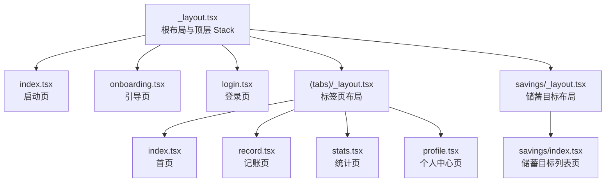
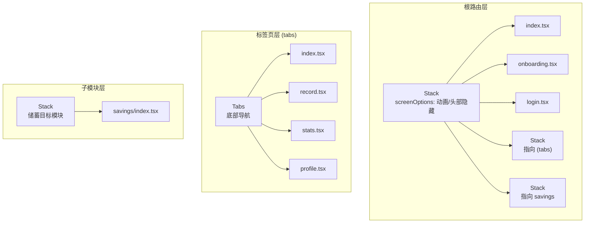
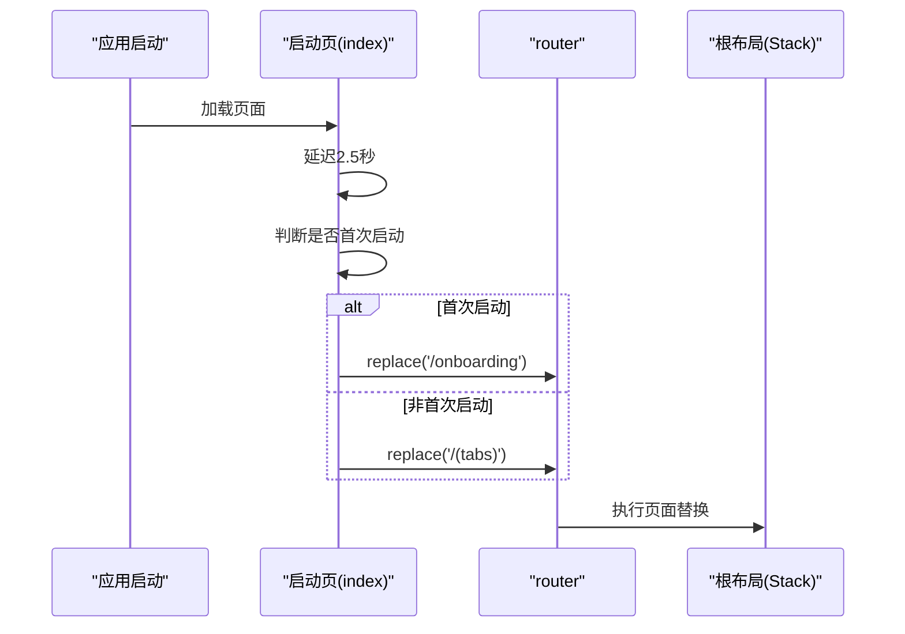
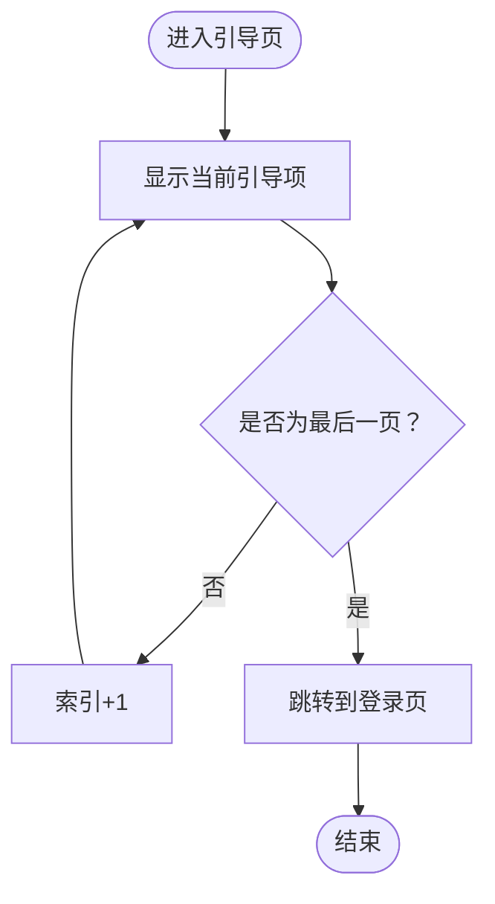
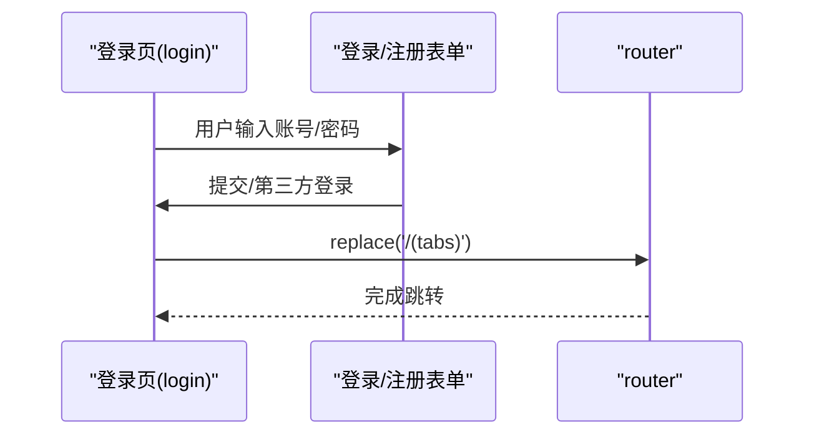
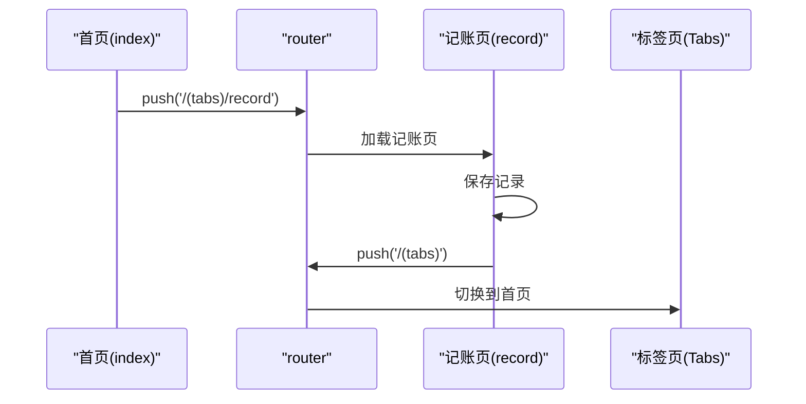
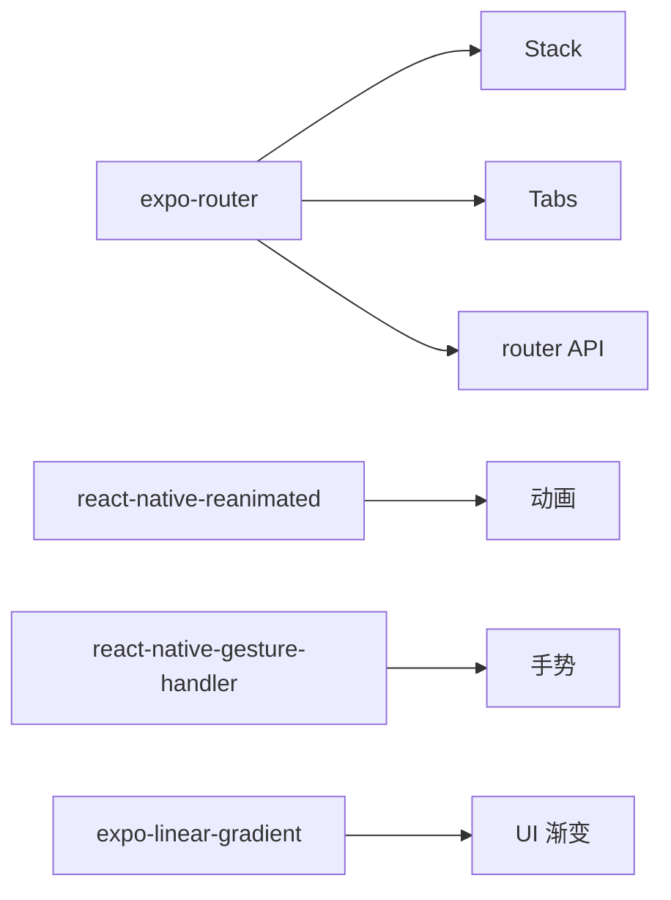

# 页面路由管理

<cite>
**本文档引用的文件**
- [根布局文件](file://src/app/_layout.tsx)
- [启动页](file://src/app/index.tsx)
- [引导页](file://src/app/onboarding.tsx)
- [登录页](file://src/app/login.tsx)
- [标签页布局](file://src/app/(tabs)/_layout.tsx)
- [首页](file://src/app/(tabs)/index.tsx)
- [记账页](file://src/app/(tabs)/record.tsx)
- [个人中心页](file://src/app/(tabs)/profile.tsx)
- [储蓄目标布局](file://src/app/savings/_layout.tsx)
- [储蓄目标列表页](file://src/app/savings/index.tsx)
- [包配置](file://package.json)
</cite>

## 目录
1. [简介](#简介)
2. [项目结构](#项目结构)
3. [核心组件](#核心组件)
4. [架构总览](#架构总览)
5. [详细组件分析](#详细组件分析)
6. [依赖关系分析](#依赖关系分析)
7. [性能考虑](#性能考虑)
8. [故障排除指南](#故障排除指南)
9. [结论](#结论)

## 简介
本文件系统性梳理该记账应用的页面路由管理，覆盖启动页、引导页、登录页的路由规则与跳转逻辑；阐述标签页导航与页面间导航方式（编程式与声明式）；说明路由参数传递与页面间数据共享策略；解释模态页面配置方法；并提供路由守卫、权限验证与错误处理的实现建议。

## 项目结构
应用采用 Expo Router 的文件系统路由约定，页面通过文件夹与文件名映射到路由路径。根布局统一声明顶层 Stack，包含启动页、引导页、登录页以及标签页等页面；标签页内部再以 Stack 或 Tabs 组织子页面。

**图表来源**
- [根布局文件](file://src/app/_layout.tsx#L33-L45)
- [标签页布局](file://src/app/(tabs)/_layout.tsx#L41-L87)
- [储蓄目标布局](file://src/app/savings/_layout.tsx#L8-L18)

**章节来源**
- [根布局文件](file://src/app/_layout.tsx#L33-L45)
- [包配置](file://package.json#L4-L4)

## 核心组件
- 根布局与顶层路由：在根布局中声明 Stack，并显式注册 index、onboarding、login、(tabs)、savings 等页面，确保路由可访问。
- 页面类型与职责：
  - 启动页：负责首屏展示与首次启动判断，随后根据条件跳转至引导页或主页。
  - 引导页：多步骤介绍功能，最后跳转至登录页。
  - 登录页：处理登录/注册流程，成功后跳转至主页。
  - 标签页：主页、记账、统计、我的四个 Tab 页面，配合底部 Tab 导航。
  - 储蓄目标：独立的 Stack 布局，承载储蓄目标列表页。

**章节来源**
- [根布局文件](file://src/app/_layout.tsx#L33-L45)
- [启动页](file://src/app/index.tsx#L53-L61)
- [引导页](file://src/app/onboarding.tsx#L75-L82)
- [登录页](file://src/app/login.tsx#L52-L60)
- [标签页布局](file://src/app/(tabs)/_layout.tsx#L49-L87)
- [储蓄目标布局](file://src/app/savings/_layout.tsx#L8-L18)

## 架构总览
应用采用“根 Stack + 标签页 + 子 Stack”的分层路由架构。根 Stack 控制全局页面切换动画与头部显示；标签页负责主功能区的 Tab 切换；子 Stack 用于特定模块（如储蓄目标）的页面栈管理。

**图表来源**
- [根布局文件](file://src/app/_layout.tsx#L33-L45)
- [标签页布局](file://src/app/(tabs)/_layout.tsx#L41-L87)
- [储蓄目标布局](file://src/app/savings/_layout.tsx#L8-L18)

## 详细组件分析

### 启动页（index）路由与跳转逻辑
- 路由规则：在根布局的 Stack 中显式注册 name="index"。
- 跳转逻辑：
  - 首次启动：2.5 秒后跳转至引导页。
  - 非首次启动：跳转至标签页主页。
- 导航方式：使用编程式导航 router.replace 实现无返回栈的页面跳转，保证首次体验流畅。

**图表来源**
- [启动页](file://src/app/index.tsx#L53-L61)
- [根布局文件](file://src/app/_layout.tsx#L40-L42)

**章节来源**
- [启动页](file://src/app/index.tsx#L53-L61)
- [根布局文件](file://src/app/_layout.tsx#L40-L42)

### 引导页（onboarding）路由与跳转逻辑
- 路由规则：在根布局的 Stack 中显式注册 name="onboarding"。
- 跳转逻辑：
  - 步进翻页：当前不是最后一页时切换索引，最后一页时跳转至登录页。
  - 跳过：直接跳转至登录页。
- 导航方式：使用编程式导航 router.replace 跳转至登录页。

**图表来源**
- [引导页](file://src/app/onboarding.tsx#L70-L82)

**章节来源**
- [引导页](file://src/app/onboarding.tsx#L70-L82)
- [根布局文件](file://src/app/_layout.tsx#L41-L42)

### 登录页（login）路由与跳转逻辑
- 路由规则：在根布局的 Stack 中显式注册 name="login"。
- 跳转逻辑：提交表单或第三方登录成功后，跳转至标签页主页。
- 导航方式：使用编程式导航 router.replace 跳转至主页。

**图表来源**
- [登录页](file://src/app/login.tsx#L51-L60)

**章节来源**
- [登录页](file://src/app/login.tsx#L51-L60)
- [根布局文件](file://src/app/_layout.tsx#L42-L42)

### 标签页导航与页面间导航
- 标签页布局：在标签页布局中声明 Tabs，每个 Tab 对应一个页面。
- 页面间导航：
  - 编程式导航：在首页快速记账按钮点击时，调用 router.push('/(tabs)/record') 跳转至记账页；在记账页完成记录后，调用 router.push('/(tabs)') 返回首页。
  - 声明式导航：标签页的 Tab 切换由 Tabs 组件自动处理，无需手动编写导航逻辑。
- 导航行为：
  - push：向页面栈压入新页面，支持返回。
  - replace：替换当前页面，不保留历史记录。

**图表来源**
- [首页](file://src/app/(tabs)/index.tsx#L55-L58)
- [记账页](file://src/app/(tabs)/record.tsx#L128-L137)
- [标签页布局](file://src/app/(tabs)/_layout.tsx#L49-L87)

**章节来源**
- [首页](file://src/app/(tabs)/index.tsx#L55-L58)
- [记账页](file://src/app/(tabs)/record.tsx#L128-L137)
- [标签页布局](file://src/app/(tabs)/_layout.tsx#L49-L87)

### 页面间导航方式与使用场景
- 编程式导航（router.push/router.replace）：
  - 使用场景：需要精确控制页面栈与返回行为，如从首页跳转到记账页、从记账页返回首页。
  - 注意事项：push 会保留历史记录，replace 不保留历史记录，适合首次引导流程。
- 声明式导航（Tabs）：
  - 使用场景：Tab 切换、固定页面跳转，无需手动编写导航逻辑。
  - 注意事项：适用于稳定的页面层级关系，避免过度嵌套导致栈混乱。

**章节来源**
- [首页](file://src/app/(tabs)/index.tsx#L55-L58)
- [记账页](file://src/app/(tabs)/record.tsx#L128-L137)
- [标签页布局](file://src/app/(tabs)/_layout.tsx#L49-L87)

### 路由参数传递与页面间数据共享
- 参数传递：
  - 查询参数：通过 router.push('/page?param=value') 传递简单数据。
  - 路径参数：通过 router.push('/page/[id]', { id }) 传递路径参数。
  - 状态传递：通过全局状态管理（如 Zustand）在页面间共享复杂数据。
- 数据共享策略：
  - 全局状态：使用 Zustand 管理用户信息、主题、语言等跨页面状态。
  - 本地存储：使用 AsyncStorage 缓存用户偏好与认证信息。
  - 页面间通信：通过查询参数或状态管理传递轻量数据。

**章节来源**
- [包配置](file://package.json#L34-L34)

### 模态页面配置（以 record/new 页面为例）
- 配置思路：
  - 在 record 模块下新增 record/new 页面，作为模态页面。
  - 在根布局或 record 布局中声明 Stack.Screen(name="record/new")。
  - 设置 presentation 为 modal，动画使用 slide_from_bottom 或自定义动画。
- 示例配置要点：
  - 屏幕选项：headerShown=false，contentStyle 背景色与根布局一致。
  - 动画：animation='slide_from_bottom' 或 'fade'。
  - 关闭：提供关闭按钮或手势关闭，使用 router.dismiss 或 router.back。

**章节来源**
- [根布局文件](file://src/app/_layout.tsx#L33-L39)
- [记账页](file://src/app/(tabs)/record.tsx#L128-L137)

## 依赖关系分析
- 路由依赖：应用依赖 expo-router 提供的 Stack、Tabs、router API。
- 动画与交互：依赖 react-native-reanimated、react-native-gesture-handler 提供的动画与手势能力。
- UI 组件：依赖 @expo/vector-icons、expo-linear-gradient 等增强视觉体验。

**图表来源**
- [包配置](file://package.json#L11-L34)

**章节来源**
- [包配置](file://package.json#L11-L34)

## 性能考虑
- 页面懒加载：利用 Expo Router 的文件系统路由特性，按需加载页面，减少初始包体积。
- 动画优化：启动页与引导页使用原生驱动动画，避免 JavaScript 线程阻塞。
- 栈管理：合理使用 push 与 replace，避免页面栈过深导致内存压力。
- 图片与资源：对渐变背景与图标进行复用，减少重复渲染。

## 故障排除指南
- 页面无法访问：
  - 检查根布局是否声明对应 Stack.Screen。
  - 确认文件名与路由命名一致，大小写敏感。
- 导航异常：
  - 确认使用正确的导航 API（push/replace），避免误用导致历史栈异常。
  - 检查路由路径格式，确保包含正确的前缀（如 /(tabs)）。
- 动画问题：
  - 确保使用 useNativeDriver 的动画属性仅用于支持原生驱动的样式属性。
  - 避免在动画过程中频繁更新不可原生驱动的属性。
- 权限与守卫：
  - 在需要鉴权的页面（如主页）增加登录态校验，未登录时重定向至登录页。
  - 使用全局拦截器或中间件在路由跳转前执行权限检查。

## 结论
该应用采用清晰的分层路由架构：根 Stack 管理全局页面，标签页负责主功能区导航，子 Stack 管理模块化页面。通过编程式与声明式导航相结合，实现了高效的页面流转与良好的用户体验。建议在后续迭代中完善路由守卫与权限验证、引入更丰富的参数传递与状态共享策略，并对模态页面进行标准化配置，以提升整体可维护性与扩展性。