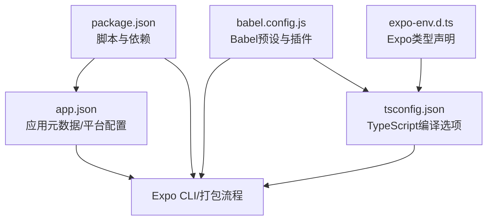
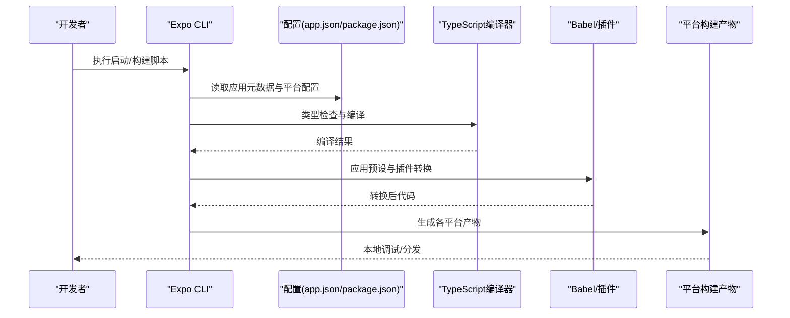
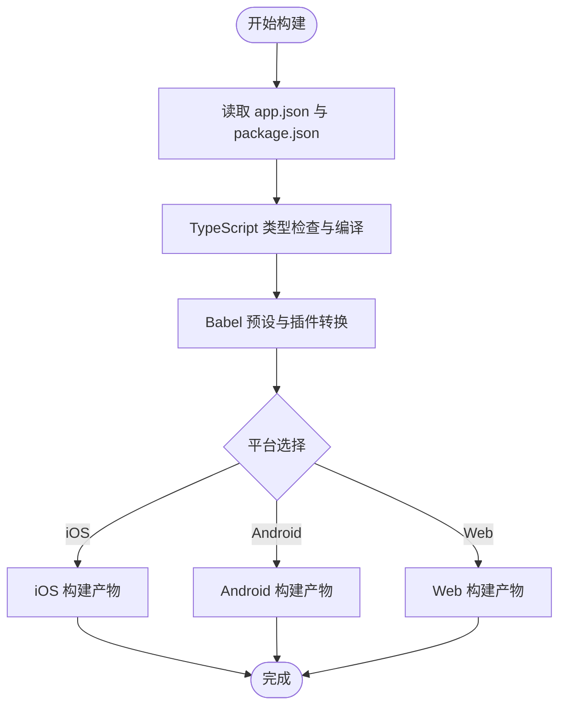
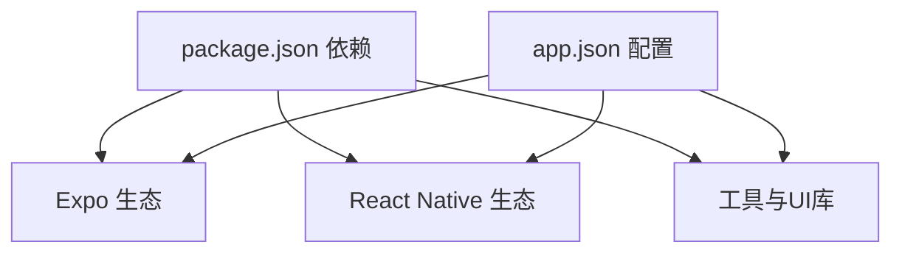

# 部署发布

<cite>
**本文引用的文件**
- [package.json](file://package.json)
- [app.json](file://app.json)
- [babel.config.js](file://babel.config.js)
- [tsconfig.json](file://tsconfig.json)
- [expo-env.d.ts](file://expo-env.d.ts)
</cite>

## 目录
1. [简介](#简介)
2. [项目结构](#项目结构)
3. [核心组件](#核心组件)
4. [架构总览](#架构总览)
5. [详细组件分析](#详细组件分析)
6. [依赖分析](#依赖分析)
7. [性能考虑](#性能考虑)
8. [故障排查指南](#故障排查指南)
9. [结论](#结论)
10. [附录](#附录)

## 简介
本文件面向“攒钱记账”应用的产品与工程团队，提供从本地开发到多平台发布的完整部署发布指南。内容覆盖构建流程、签名配置、版本管理、平台适配（iOS/Android/Web）、应用商店优化（ASO）与推广策略、自动化部署与持续集成（CI/CD）建议，以及版本迭代的操作手册。本文所有技术细节均基于仓库中的实际配置文件进行提炼与总结。

## 项目结构
该应用采用 Expo 跨平台框架，使用 React Native 与 Expo Router 进行页面路由管理，并通过 TypeScript 提升类型安全。关键配置集中在以下文件中：
- 应用元数据与平台配置：app.json
- 构建与运行脚本：package.json
- 编译与插件配置：babel.config.js、tsconfig.json
- 类型声明：expo-env.d.ts

图表来源
- [package.json](file://package.json#L1-L43)
- [app.json](file://app.json#L1-L29)
- [babel.config.js](file://babel.config.js#L1-L8)
- [tsconfig.json](file://tsconfig.json#L1-L14)
- [expo-env.d.ts](file://expo-env.d.ts#L1-L3)

章节来源
- [package.json](file://package.json#L1-L43)
- [app.json](file://app.json#L1-L29)
- [babel.config.js](file://babel.config.js#L1-L8)
- [tsconfig.json](file://tsconfig.json#L1-L14)
- [expo-env.d.ts](file://expo-env.d.ts#L1-L3)

## 核心组件
- 应用元数据与平台标识
  - 应用名称、版本、URL Scheme、界面风格等在 app.json 中集中定义。
  - iOS 与 Android 均使用统一 bundleIdentifier/package，便于跨平台一致性管理。
- 构建与运行脚本
  - 通过 npm/yarn 脚本启动开发服务器与目标平台调试。
- 编译与插件链路
  - 使用 Expo 推荐的 Babel 预设与 Reanimated 插件，确保动画与转译兼容性。
  - TypeScript 严格模式与路径别名配置提升开发体验与可维护性。
- 类型支持
  - 引入 Expo 的类型声明文件，保证开发时的类型完整性。

章节来源
- [app.json](file://app.json#L1-L29)
- [package.json](file://package.json#L5-L10)
- [babel.config.js](file://babel.config.js#L1-L8)
- [tsconfig.json](file://tsconfig.json#L1-L14)
- [expo-env.d.ts](file://expo-env.d.ts#L1-L3)

## 架构总览
下图展示从本地开发到多平台构建的关键流程：开发者通过脚本启动 Expo 开发服务器；Expo CLI 结合 app.json 的平台配置生成对应平台的产物；TypeScript 与 Babel 在构建阶段完成类型检查与语法转换；最终产物用于本地调试或提交到各应用商店。

图表来源
- [package.json](file://package.json#L5-L10)
- [app.json](file://app.json#L1-L29)
- [babel.config.js](file://babel.config.js#L1-L8)
- [tsconfig.json](file://tsconfig.json#L1-L14)

## 详细组件分析

### 构建与打包流程
- 启动与调试
  - 通过脚本启动开发服务器，支持同时针对 iOS、Android 与 Web 平台进行调试。
- 构建阶段
  - TypeScript 编译与类型检查在构建前执行，确保类型安全。
  - Babel 应用 Expo 推荐预设与 Reanimated 插件，处理语法转换与运行时增强。
- 平台适配
  - app.json 中的平台字段（如 iOS Bundle Identifier、Android Package）决定最终包的标识与安装包名。
- 版本管理
  - 应用版本号在 app.json 与 package.json 中同步维护，建议遵循语义化版本控制。

图表来源
- [package.json](file://package.json#L5-L10)
- [app.json](file://app.json#L1-L29)
- [babel.config.js](file://babel.config.js#L1-L8)
- [tsconfig.json](file://tsconfig.json#L1-L14)

章节来源
- [package.json](file://package.json#L5-L10)
- [app.json](file://app.json#L1-L29)
- [babel.config.js](file://babel.config.js#L1-L8)
- [tsconfig.json](file://tsconfig.json#L1-L14)

### 签名与发布配置
- iOS 签名
  - app.json 中已配置 iOS Bundle Identifier，需配合 Apple Developer 账户与 Xcode 完成证书与描述文件配置。
  - 建议在 CI 中使用 Fastlane 或 Expo 配置进行自动化签名与上传。
- Android 签名
  - app.json 中已配置 Android Package，需准备 Keystore 并在 CI 中注入密钥参数。
  - 建议通过 Gradle 自动化签名与版本号注入。
- Web 发布
  - app.json 指定 Web 打包器与输出目录，构建后可直接部署至静态托管服务。

章节来源
- [app.json](file://app.json#L10-L20)

### 版本管理与迭代
- 版本号位置
  - 应用版本号位于 app.json 与 package.json，建议保持一致。
- 迭代节奏
  - 建议以功能里程碑为单位进行版本发布，每次发布前完成回归测试与 ASO 元数据更新。
- 变更记录
  - 建议在发布说明中明确新增功能、修复问题与已知限制。

章节来源
- [app.json](file://app.json#L3-L6)
- [package.json](file://package.json#L3-L4)

### 平台适配与差异
- iOS
  - 支持平板与深色模式适配，Bundle Identifier 已在配置中指定。
- Android
  - 包名已在配置中指定，建议在 CI 中统一注入版本号与签名参数。
- Web
  - 使用 Metro 作为打包器，输出静态资源，适合部署至 CDN 或静态托管平台。

章节来源
- [app.json](file://app.json#L10-L20)

### 应用商店优化（ASO）
- 应用名称与关键词
  - 名称“攒钱记账”简洁明确，建议在商店页面标题与关键词中突出“记账”“储蓄”“理财”等高价值词。
- 截图与演示视频
  - 准备覆盖核心功能（记账、统计、储蓄计划）的截图与简短视频，强调易用性与可视化。
- 评分与评论
  - 鼓励早期用户留下反馈，及时响应差评并改进体验。
- 多语言与地区化
  - 如计划扩展市场，建议提供多语言元数据与本地化文案。

### 推广策略
- 社交媒体与内容营销
  - 通过微信公众号、小红书等渠道分享记账技巧与应用亮点，引导下载。
- 用户留存与激励
  - 设计新手任务与成就系统，结合节日活动提升活跃度。
- 数据驱动优化
  - 通过埋点与分析工具评估关键转化路径，持续优化注册与付费转化。

### 自动化部署与持续集成（CI/CD）
- CI 流程建议
  - 触发条件：主分支合并或标签推送。
  - 步骤：
    - 安装依赖与缓存恢复
    - 类型检查与单元测试
    - 平台构建（iOS/Android/Web）
    - 产物上传与归档
    - 应用商店元数据更新（可选）
- 平台特定建议
  - iOS：使用 Fastlane 或 Expo 配置进行签名与上传。
  - Android：通过 Gradle 注入签名与版本参数，上传至 Google Play Console。
  - Web：构建后部署至 CDN 或静态托管平台。
- 密钥与环境变量
  - 将签名密钥、Apple/Google 账户凭据等敏感信息存储于 CI 的机密变量中。

### 发布与审核流程（iOS/Android）
- iOS 审核要点
  - 内容与隐私政策合规，避免误导性描述。
  - 图标与截图清晰，符合 App Store 设计规范。
  - 功能稳定，无崩溃与性能问题。
- Android 审核要点
  - 权限最小化原则，明确用途。
  - 隐私政策链接有效，数据收集透明。
  - 避免与竞品混淆的名称与图标。
- 版本发布节奏
  - 建议在审核周期前至少提前一周发布，预留修改时间。

## 依赖分析
- 关键依赖
  - Expo 生态：Expo、Expo Router、Expo Constants、Expo Font、Expo Splash Screen 等。
  - React 生态：React、React Native、Reanimated、Gesture Handler、Safe Area Context、Screens 等。
  - 工具链：Axios、Chart Kit、SVG、Zustand 状态管理等。
- 依赖关系
  - app.json 中的插件与实验特性需与依赖版本匹配，避免冲突。
  - Babel 与 TypeScript 配置需与依赖版本兼容。

图表来源
- [package.json](file://package.json#L11-L35)
- [app.json](file://app.json#L21-L26)

章节来源
- [package.json](file://package.json#L11-L35)
- [app.json](file://app.json#L21-L26)

## 性能考虑
- 构建性能
  - 启用 Babel 缓存与增量编译，减少重复工作量。
  - 在 CI 中合理设置依赖缓存策略，缩短流水线时间。
- 运行时性能
  - 使用 Reanimated 与 Gesture Handler 优化动画与手势性能。
  - 控制包体大小，移除未使用依赖，按需加载模块。
- 类型与质量
  - 严格 TypeScript 配置有助于早期发现潜在问题，降低运行时错误率。

## 故障排查指南
- 构建失败
  - 检查 app.json 与 package.json 的版本号是否一致。
  - 确认 Babel 预设与插件版本与 Expo 版本兼容。
- 类型错误
  - 确保 expo-env.d.ts 已正确引入，且 tsconfig.json 的 include 覆盖到该文件。
- 平台差异
  - iOS/Android 的 Bundle Identifier 与 Package 必须唯一且与证书/签名匹配。
- CI 集成
  - 确认 CI 中的密钥与环境变量已正确注入，构建日志中无敏感信息泄露。

章节来源
- [babel.config.js](file://babel.config.js#L1-L8)
- [tsconfig.json](file://tsconfig.json#L1-L14)
- [expo-env.d.ts](file://expo-env.d.ts#L1-L3)
- [app.json](file://app.json#L10-L20)

## 结论
本指南基于仓库现有配置，给出了“攒钱记账”应用从本地开发到多平台发布的完整路径。建议在正式发布前完善 CI/CD、ASO 与推广策略，并建立版本迭代与回滚机制，确保快速、稳定地交付高质量版本。

## 附录
- 快速检查清单
  - app.json 与 package.json 版本号一致
  - Babel 与 TypeScript 配置与依赖版本匹配
  - iOS/Android 签名与证书配置完成
  - CI 中密钥与环境变量已注入
  - ASO 元数据与截图准备就绪
  - 回归测试与性能测试通过