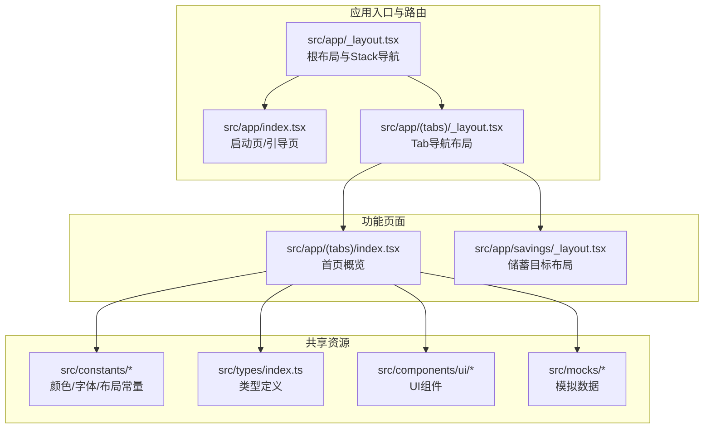
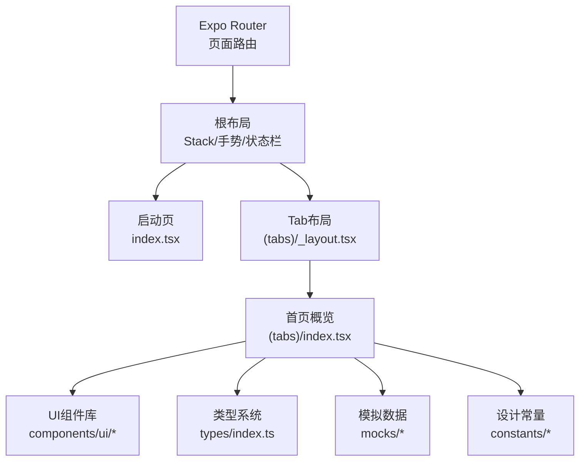
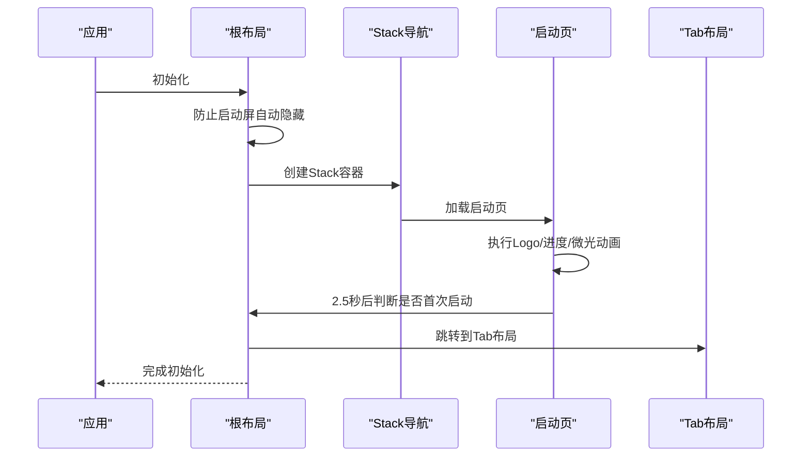
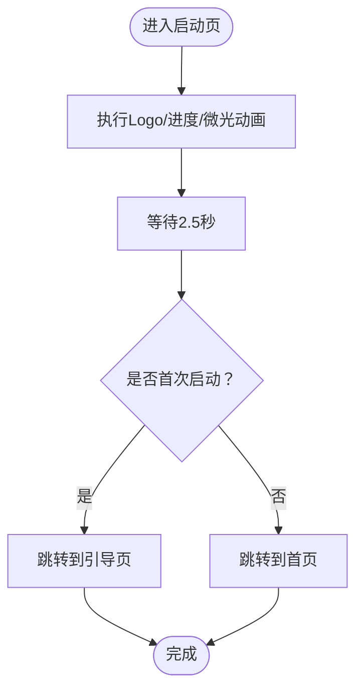
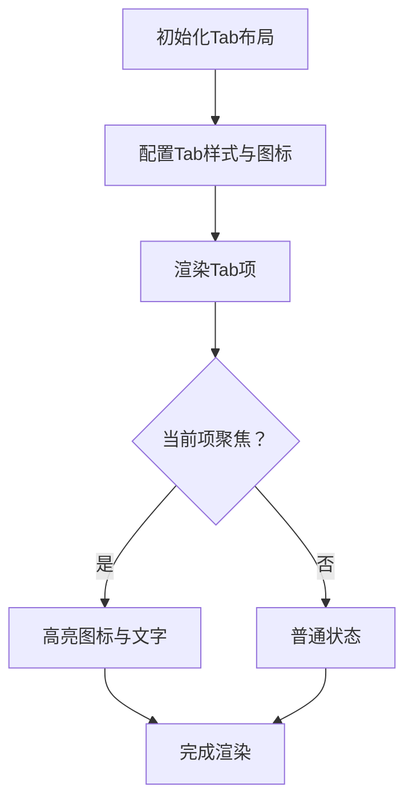
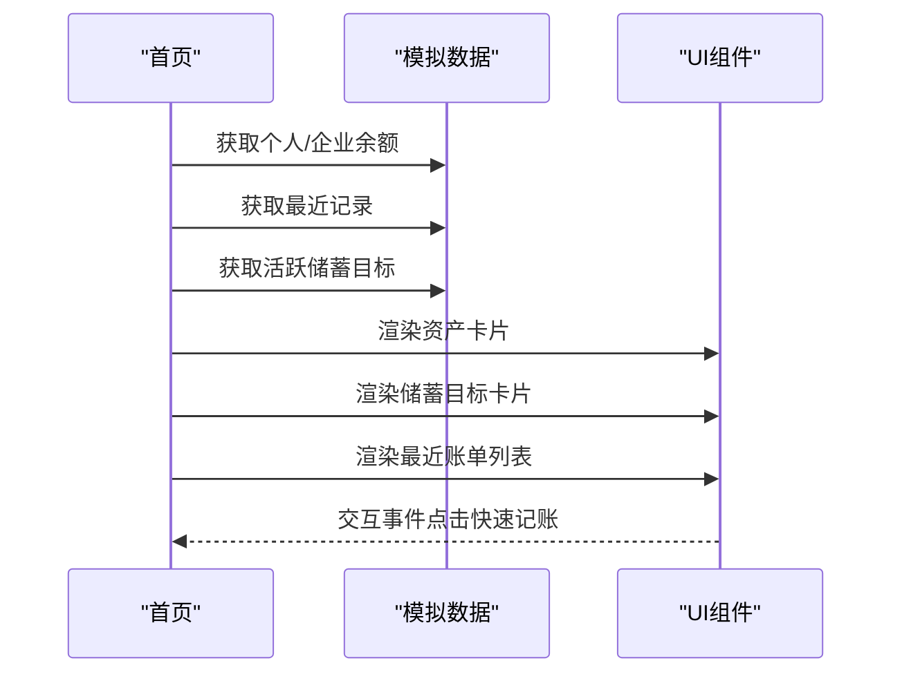
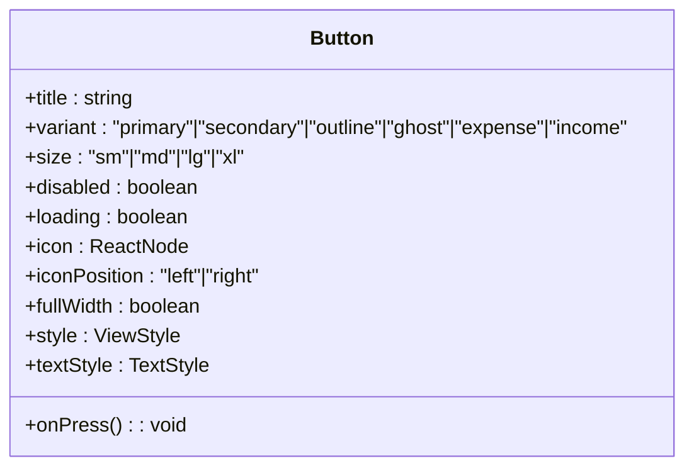
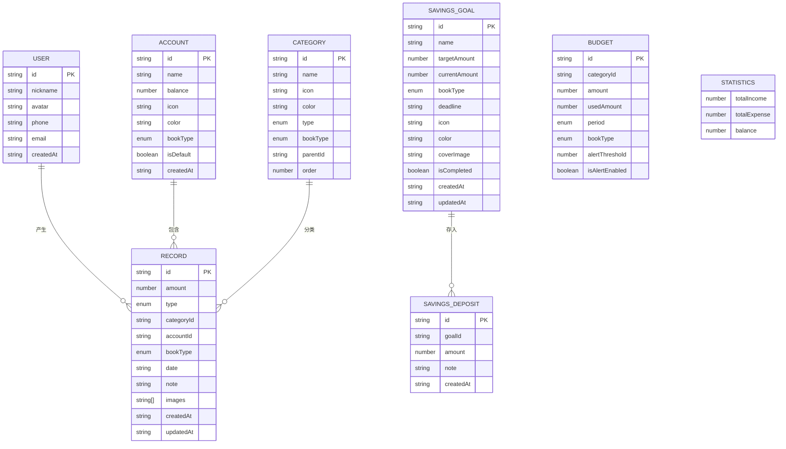
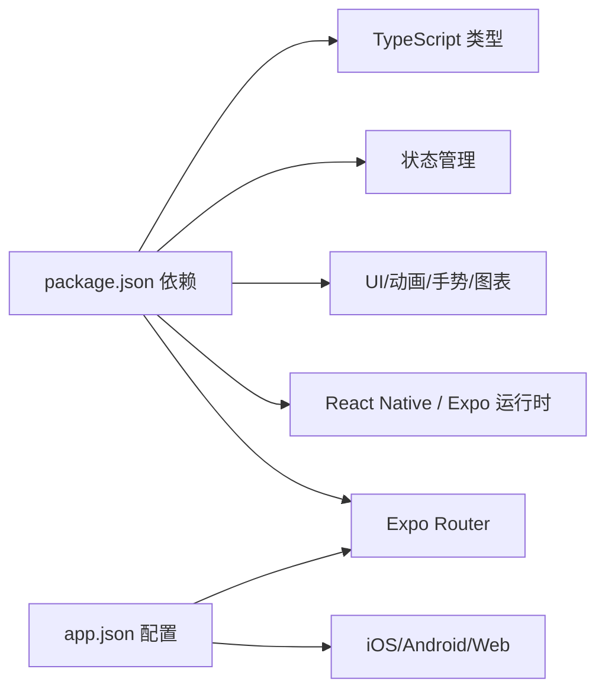

# 项目概述

<cite>
**本文档引用的文件**
- [package.json](file://package.json)
- [app.json](file://app.json)
- [src/app/_layout.tsx](file://src/app/_layout.tsx)
- [src/app/index.tsx](file://src/app/index.tsx)
- [src/app/(tabs)/_layout.tsx](file://src/app/(tabs)/_layout.tsx)
- [src/app/(tabs)/index.tsx](file://src/app/(tabs)/index.tsx)
- [src/types/index.ts](file://src/types/index.ts)
- [src/constants/colors.ts](file://src/constants/colors.ts)
- [src/constants/index.ts](file://src/constants/index.ts)
- [src/components/ui/Button.tsx](file://src/components/ui/Button.tsx)
- [src/mocks/accounts.ts](file://src/mocks/accounts.ts)
- [src/mocks/categories.ts](file://src/mocks/categories.ts)
- [src/mocks/records.ts](file://src/mocks/records.ts)
- [src/mocks/savings.ts](file://src/mocks/savings.ts)
</cite>

## 目录
1. [引言](#引言)
2. [项目结构](#项目结构)
3. [核心组件](#核心组件)
4. [架构总览](#架构总览)
5. [详细组件分析](#详细组件分析)
6. [依赖关系分析](#依赖关系分析)
7. [性能考虑](#性能考虑)
8. [故障排除指南](#故障排除指南)
9. [结论](#结论)
10. [附录](#附录)

## 引言
“攒钱记账”是一个基于 React Native 和 Expo 的跨平台移动应用，采用 Expo Router 实现页面路由与导航，支持 iOS、Android 与 Web 平台。项目以“个人与企业双账本”为核心理念，提供记账、储蓄目标追踪与财务概览能力，并通过渐变与玻璃态设计语言营造现代、优雅的用户体验。

- 业务目标：帮助用户高效管理个人与企业收支，设定并追踪储蓄目标，生成可视化财务概览。
- 目标用户：注重理财的个人用户与需要简易记账的企业/团队成员。
- 技术优势：跨平台一次开发，统一代码库适配多端；使用 Expo 生态与现代 React Native 能力，提升开发效率与运行性能。

## 项目结构
项目采用按功能模块划分的目录组织方式，核心目录与职责如下：
- src/app：页面与路由层，包含根布局、引导页、登录页、Tab 导航与各功能页面。
- src/components/ui：可复用 UI 组件库，如按钮、卡片等。
- src/constants：设计常量（颜色、字体、布局）集中管理。
- src/types：TypeScript 类型定义，覆盖用户、账户、分类、账单、储蓄目标等模型。
- src/mocks：模拟数据与工具函数，支撑首页概览与功能演示。
- 根目录配置：package.json、app.json、tsconfig.json 等，定义依赖、构建与运行参数。

图表来源
- [src/app/_layout.tsx](file://src/app/_layout.tsx#L1-L61)
- [src/app/index.tsx](file://src/app/index.tsx#L1-L249)
- [src/app/(tabs)/_layout.tsx](file://src/app/(tabs)/_layout.tsx#L1-L121)
- [src/app/(tabs)/index.tsx](file://src/app/(tabs)/index.tsx#L1-L563)
- [src/constants/index.ts](file://src/constants/index.ts#L1-L12)
- [src/types/index.ts](file://src/types/index.ts#L1-L141)
- [src/components/ui/Button.tsx](file://src/components/ui/Button.tsx#L1-L204)
- [src/mocks/accounts.ts](file://src/mocks/accounts.ts#L1-L91)

章节来源
- [package.json](file://package.json#L1-L43)
- [app.json](file://app.json#L1-L29)

## 核心组件
- 根布局与导航：统一的 Stack 导航容器，控制状态栏样式、背景色与页面切换动画，承载启动页、引导页、登录页与 Tab 页面。
- 启动页：实现品牌渐变背景、存钱罐图标动画与进度条加载，2.5 秒后根据首次启动判断跳转至引导或主界面。
- Tab 导航：底部 Tab 切换首页、记账、统计、我的，图标与标签聚焦态高亮，适配安全区与阴影。
- 首页概览：展示个人/企业双账本资产、今日收支、快速记账入口、储蓄目标进度与最近账单列表。
- UI 组件：渐变按钮组件支持多种变体与尺寸，内置加载态与图标位置控制。
- 类型系统：涵盖用户、账户、分类、账单、储蓄目标、预算、统计等完整领域模型。
- 模拟数据：提供账户、分类、账单与储蓄目标的 Mock 数据及查询工具，支撑前端演示与开发联调。

章节来源
- [src/app/_layout.tsx](file://src/app/_layout.tsx#L1-L61)
- [src/app/index.tsx](file://src/app/index.tsx#L1-L249)
- [src/app/(tabs)/_layout.tsx](file://src/app/(tabs)/_layout.tsx#L1-L121)
- [src/app/(tabs)/index.tsx](file://src/app/(tabs)/index.tsx#L1-L563)
- [src/components/ui/Button.tsx](file://src/components/ui/Button.tsx#L1-L204)
- [src/types/index.ts](file://src/types/index.ts#L1-L141)
- [src/mocks/accounts.ts](file://src/mocks/accounts.ts#L1-L91)
- [src/mocks/categories.ts](file://src/mocks/categories.ts#L1-L69)
- [src/mocks/records.ts](file://src/mocks/records.ts#L1-L117)
- [src/mocks/savings.ts](file://src/mocks/savings.ts#L1-L111)

## 架构总览
应用采用“页面路由 + 组件库 + 类型系统 + 模拟数据”的分层架构：
- 路由层：Expo Router 管理页面栈与导航，根布局统一注入手势处理、状态栏与全局样式。
- 视图层：页面组件负责数据获取与渲染，使用 UI 组件与常量系统保证一致性。
- 数据层：当前为本地 Mock 数据，后续可替换为真实 API 与本地存储。
- 配置层：Expo 与 Metro 配置、TypeScript 类型检查、包管理脚本。

图表来源
- [src/app/_layout.tsx](file://src/app/_layout.tsx#L1-L61)
- [src/app/index.tsx](file://src/app/index.tsx#L1-L249)
- [src/app/(tabs)/_layout.tsx](file://src/app/(tabs)/_layout.tsx#L1-L121)
- [src/app/(tabs)/index.tsx](file://src/app/(tabs)/index.tsx#L1-L563)
- [src/components/ui/Button.tsx](file://src/components/ui/Button.tsx#L1-L204)
- [src/types/index.ts](file://src/types/index.ts#L1-L141)
- [src/mocks/accounts.ts](file://src/mocks/accounts.ts#L1-L91)
- [src/constants/index.ts](file://src/constants/index.ts#L1-L12)

## 详细组件分析

### 根布局与导航
- 职责：统一注入手势处理根视图、状态栏样式、全局背景色与页面切换动画；控制启动屏显示时机与字体加载。
- 关键点：Stack 导航禁用标题栏，设置内容样式与滑入动画；启动屏防自动隐藏，字体加载完成后隐藏。

图表来源
- [src/app/_layout.tsx](file://src/app/_layout.tsx#L1-L61)
- [src/app/index.tsx](file://src/app/index.tsx#L1-L249)

章节来源
- [src/app/_layout.tsx](file://src/app/_layout.tsx#L1-L61)

### 启动页（品牌动画与跳转）
- 职责：展示品牌渐变背景与存钱罐图标动画，显示进度条与版本号，2.5 秒后根据首次启动逻辑跳转。
- 关键点：Logo 缩放与透明度动画、进度条填充动画、微光扫过动画；版本号展示。

图表来源
- [src/app/index.tsx](file://src/app/index.tsx#L1-L249)

章节来源
- [src/app/index.tsx](file://src/app/index.tsx#L1-L249)

### Tab 导航布局
- 职责：定义底部 Tab 样式与图标，支持聚焦态高亮与标签隐藏，统一导航样式。
- 关键点：图标映射（🏠/🏡/✏️/📝/📊/📈/👤），聚焦态缩放与文字加粗，适配安全区与阴影。

图表来源
- [src/app/(tabs)/_layout.tsx](file://src/app/(tabs)/_layout.tsx#L1-L121)

章节来源
- [src/app/(tabs)/_layout.tsx](file://src/app/(tabs)/_layout.tsx#L1-L121)

### 首页概览（今日资产与快捷操作）
- 职责：展示个人/企业双账本资产、今日收支趋势、快速记账入口、储蓄目标进度与最近账单。
- 关键点：账本切换器、资产卡片、快速记账按钮、水平滚动储蓄目标卡片、垂直列表最近账单。

图表来源
- [src/app/(tabs)/index.tsx](file://src/app/(tabs)/index.tsx#L1-L563)
- [src/mocks/accounts.ts](file://src/mocks/accounts.ts#L1-L91)
- [src/mocks/records.ts](file://src/mocks/records.ts#L1-L117)
- [src/mocks/savings.ts](file://src/mocks/savings.ts#L1-L111)

章节来源
- [src/app/(tabs)/index.tsx](file://src/app/(tabs)/index.tsx#L1-L563)

### 渐变按钮组件
- 职责：提供多种变体（主按钮、次级、描边、幽灵、支出、收入）、尺寸与加载态的统一按钮。
- 关键点：根据变体选择背景色与渐变色，支持图标左右布局与全宽模式。

图表来源
- [src/components/ui/Button.tsx](file://src/components/ui/Button.tsx#L1-L204)

章节来源
- [src/components/ui/Button.tsx](file://src/components/ui/Button.tsx#L1-L204)

### 类型系统（领域模型）
- 职责：定义用户、账户、分类、账单、储蓄目标、预算、统计数据等核心领域模型，确保类型安全。
- 关键点：区分个人与企业账本类型，交易类型（收入/支出），统计聚合结构。

图表来源
- [src/types/index.ts](file://src/types/index.ts#L1-L141)

章节来源
- [src/types/index.ts](file://src/types/index.ts#L1-L141)

### 设计常量与主题
- 职责：集中管理主色调、账本标识色、收支颜色、背景色、文字色、边框与状态色，以及主题渐变配置。
- 关键点：个人账本（紫色系）、企业账本（蓝色系）、收入/支出对比色，支持透明度与灰阶体系。

章节来源
- [src/constants/colors.ts](file://src/constants/colors.ts#L1-L88)
- [src/constants/index.ts](file://src/constants/index.ts#L1-L12)

## 依赖关系分析
- 运行时依赖：Expo 核心、路由、字体、状态栏、启动屏、手势、动画、屏幕适配、Web 支持、图表绘制、状态管理等。
- 开发依赖：TypeScript、Babel、React 18.3.1 与 React Native 0.76.3。
- 配置：Expo 应用元数据（名称、版本、平台标识、插件与实验特性）、Metro/Web 打包配置。

图表来源
- [package.json](file://package.json#L1-L43)
- [app.json](file://app.json#L1-L29)

章节来源
- [package.json](file://package.json#L1-L43)
- [app.json](file://app.json#L1-L29)

## 性能考虑
- 动画与渲染：使用原生驱动动画与线性渐变，减少 JS 层计算开销；避免在滚动列表中进行复杂布局重排。
- 导航与懒加载：利用 Expo Router 的页面栈管理，避免不必要的页面重建；图片与图表组件按需加载。
- 数据访问：当前使用本地 Mock 数据，建议在生产环境引入缓存策略与分页加载，降低首屏压力。
- 跨平台优化：合理使用平台差异常量与安全区适配，避免过度阴影与半透明叠加导致的性能损耗。

## 故障排除指南
- 启动屏不消失：确认根布局已阻止自动隐藏并在字体加载完成后主动隐藏。
- 字体未生效：检查字体加载钩子与字体资源路径，确保字体加载成功后再渲染页面。
- 导航异常：检查 Stack 与 Tab 的 screenOptions 配置，确保 header 显示与背景色一致。
- 图表/动画卡顿：减少复杂渐变与阴影层级，优先使用原生驱动动画；避免在滚动中嵌套重型组件。
- 数据不更新：Mock 数据更新后需确保页面重新渲染或引入状态管理刷新机制。

章节来源
- [src/app/_layout.tsx](file://src/app/_layout.tsx#L1-L61)
- [src/app/index.tsx](file://src/app/index.tsx#L1-L249)

## 结论
“攒钱记账”项目以清晰的分层架构与统一的设计语言，构建了跨平台的个人与企业财务管理体验。通过类型系统与模拟数据，项目在早期阶段即可快速迭代功能原型；随着业务推进，可逐步接入真实 API、本地存储与更丰富的财务分析能力，持续提升用户体验与产品价值。

## 附录
- 版本信息：应用版本 v1.0.0，基于 Expo 52、React Native 0.76.3、Expo Router 4.0。
- 许可证：仓库未包含许可证文件，默认遵循私有许可（private: true）。
- 发展历程：当前处于功能原型阶段，重点完成首页概览、储蓄目标与记账入口的交互设计与数据展示。

章节来源
- [app.json](file://app.json#L1-L29)
- [package.json](file://package.json#L1-L43)